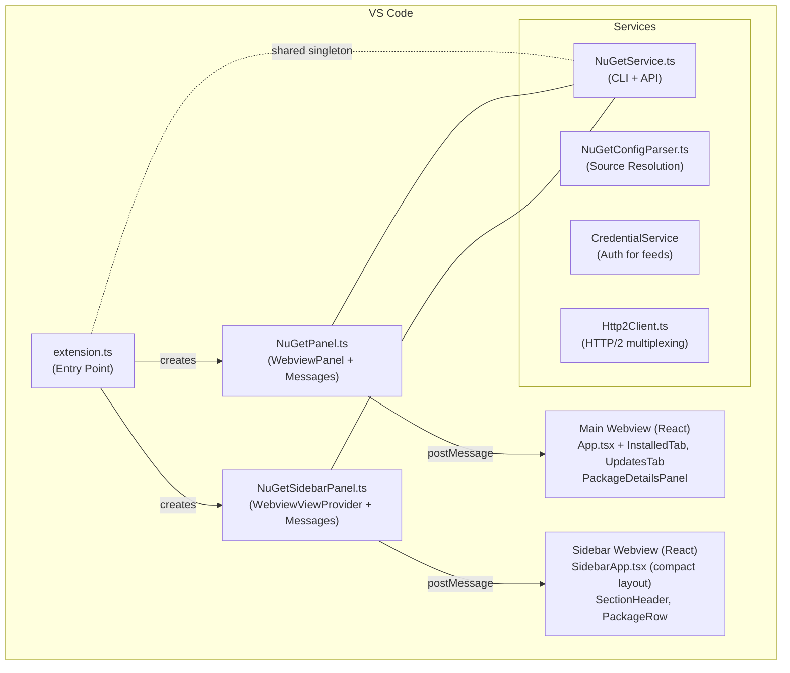
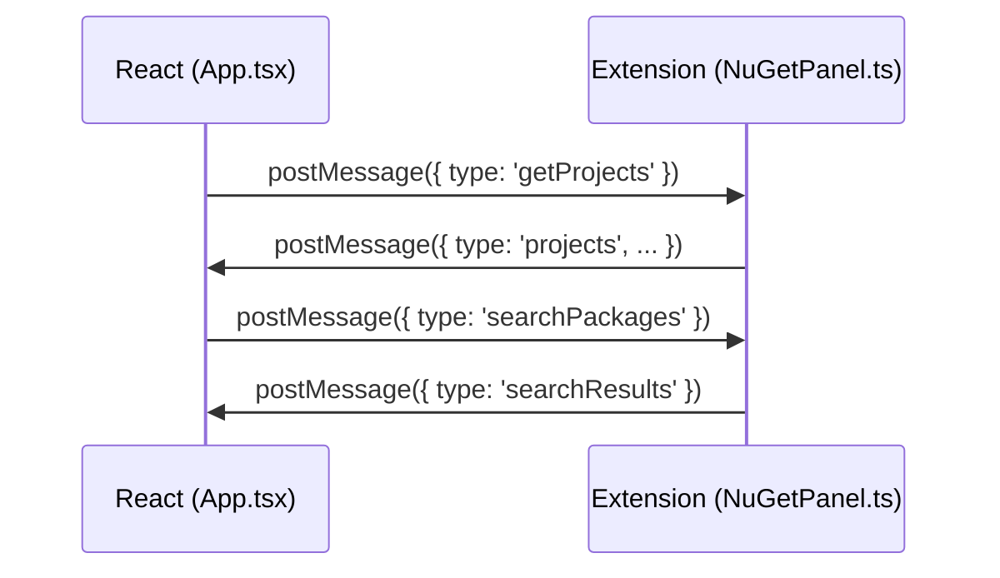
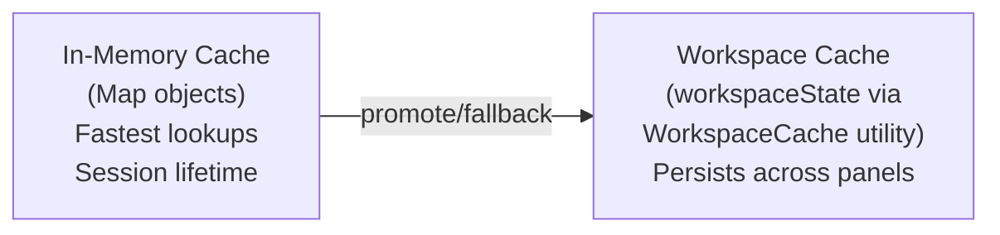
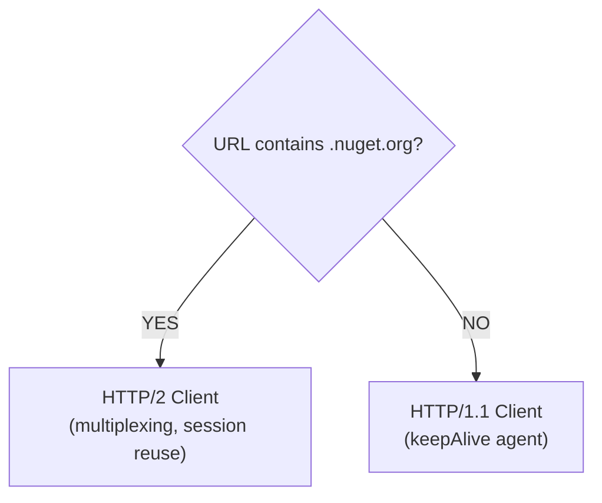
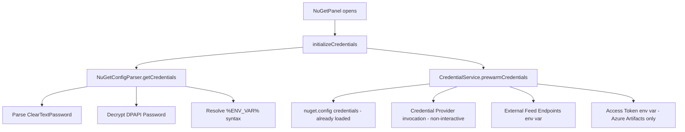

# Architecture

This document describes the technical architecture of the nUIget VS Code extension.

## Overview



## File Structure

```
src/
├── extension.ts              # Extension entry point, command registration, shared NuGetService
├── webview/
│   ├── NuGetPanel.ts         # WebviewPanel, message handling, state persistence
│   ├── NuGetSidebarPanel.ts  # WebviewViewProvider for Activity Bar sidebar
│   ├── app/
│   │   ├── index.tsx         # React entry point with ErrorBoundary
│   │   ├── App.tsx           # Application shell with unified search bar (~2420 lines)
│   │   ├── App.css           # Styles (includes high-contrast, reduced-motion, icon utilities)
│   │   ├── types.ts          # Shared types, LRUMap, utility functions
│   │   ├── icons.tsx          # Inline SVG icon components (codicon-compatible, theme-aware)
│   │   ├── markdownSetup.ts  # hljs language registration, marked config, renderMarkdownToHtml()
│   │   ├── utils/
│   │   │   └── parseSearchQuery.ts  # Shared search parser (SearchMode, FILTER_PREFIXES)
│   │   ├── components/
│   │   │   ├── InstalledTab.tsx           # Installed tab (~1250 lines)
│   │   │   ├── UpdatesTab.tsx             # Updates tab (~710 lines)
│   │   │   ├── PackageDetailsPanel.tsx    # Details panel (~510 lines)
│   │   │   ├── DraggableSash.tsx          # Resizable split panel sash
│   │   │   └── SourceSettingsOverlay.tsx  # Source settings modal (forwardRef, owns form state)
│   │   └── hooks/
│   │       └── usePackageSelection.ts  # Package selection logic hook
│   └── sidebar/
│       ├── index.tsx              # Sidebar React entry point
│       ├── SidebarApp.tsx         # Sidebar main component (split-panel sections)
│       ├── SidebarApp.css         # Sidebar styles
│       └── components/
│           ├── SectionHeader.tsx   # Collapsible section header
│           └── PackageRow.tsx      # Compact package row with hover actions
├── services/
│   ├── NuGetService.ts       # Facade: delegates to sub-services, retains HTTP/source health/CLI (~1020 lines)
│   ├── NuGetPackageService.ts # Package search, metadata, versions, vulnerabilities, icons, updates (~2060 lines)
│   ├── NuGetCliService.ts    # dotnet CLI operations (install/update/remove/restore, SDK detection)
│   ├── NuGetSourceService.ts # Source CRUD, config file management, source name generation
│   ├── NuGetProjectService.ts # Project discovery, .csproj parsing, transitive deps, assets.json caching
│   ├── NuGetLogger.ts        # Logging utilities (setupOutputChannel, logOutput/Success/Warning/Error, sanitize)
│   ├── NuGetTypes.ts         # Shared NuGet types (VersionSpec, Project, PackageMetadata, etc.)
│   ├── NuGetUtils.ts         # Standalone utilities (LRUMap, batchedPromiseAll, validators, isNewerVersion, topologicalSortByDependency)
│   ├── NuGetOperations.ts    # Shared package operation + query functions (install/update/remove, bulk variants, all-projects queries)
│   ├── NuGetConfigParser.ts  # nuget.config parsing, credential resolution
│   ├── CredentialService.ts  # Authentication for private feeds (DPAPI, Cred Provider)
│   ├── Http2Client.ts        # HTTP/2 client with session reuse for nuget.org
│   └── WorkspaceCache.ts     # Persistent caching with TTL support
├── test/
│   ├── __mocks__/
│   │   └── vscode.ts         # VS Code API mock (commands, window, workspace, Uri, etc.)
│   ├── fixtures/
│   │   ├── api-responses.ts  # Typed NuGet API response fixtures
│   │   ├── sample.csproj     # Sample .csproj for parsing tests
│   │   ├── multi-version.csproj  # Multi-framework .csproj fixture
│   │   ├── project.assets.json   # Transitive dependency fixture
│   │   ├── nuget.config      # NuGet config fixture
│   │   ├── registration-response.json  # NuGet registration API fixture
│   │   ├── search-response.json        # NuGet search API fixture
│   │   ├── service-index.json          # NuGet service index fixture
│   │   ├── bin/              # Build output fixture
│   │   └── obj/              # Restore output fixture (project.assets.json)
│   ├── helpers/
│   │   ├── index.ts          # Re-exports for test helpers
│   │   ├── backend.ts        # Backend test utilities (mock services, exec helpers)
│   │   └── frontend.tsx      # Frontend test utilities (render with VS Code context)
│   ├── benchmarks/           # Performance benchmarks (*.bench.ts)
│   ├── integration/          # Integration tests with MSW (*.integration.test.ts)
│   ├── e2e/                  # End-to-end tests (VS Code Test)
│   ├── ui/                   # UI tests (ExTester/Selenium)
│   └── setup-frontend.ts    # jsdom setup (jest-dom matchers, acquireVsCodeApi shim)
```

### Module Split: NuGetService
`NuGetService.ts` is a facade that delegates to five sub-services:
- **`NuGetPackageService.ts`** (~1920 lines) — Package search (`searchPackages`, `searchPackagesViaApi`, `quickSearchGrouped`), metadata resolution (`getPackageMetadata`, `getPackageMetadataFromSource/Search/Nuspec`), version queries (`getPackageVersions`, `getPackageVersionsFromSource`), vulnerability data (`fetchVulnerabilityData`, `getVulnerabilities`), icon URL resolution (`resolveIconUrl`, `getPackageIconUrl`), update checking (`checkPackageUpdates`, `checkPackageUpdatesMinimal` — both pre-resolve sources via `resolveSourcesForBatch()` before batch loop), README extraction, size fetching, and installed package metadata. Uses `PackageServiceDeps` interface for dependency injection — receives HTTP, source, and endpoint methods from `NuGetService` via arrow function bindings. Owns caches: `metadataCache(200)`, `iconUrlCache(500)`, `versionsCache(200)`, `verifiedStatusCache(300)`, `searchResultsCache(100)`, `quickSearchCache(100, 30s TTL)`, `vulnerabilityData(Map)`.
- **`NuGetCliService.ts`** — dotnet CLI operations (install/update/remove/restore), SDK detection (`getSdkMajorVersion`, `useNounFirstSyntax`), HTTP cache clearing, `dotnet package search`.
- **`NuGetSourceService.ts`** — Source CRUD (`getSources`, `addSource`, `removeSource`, `enableSource`, `disableSource`), nuget.config file management, source name generation.
- **`NuGetProjectService.ts`** (~470 lines) — Project discovery, `.csproj` parsing, installed packages, transitive dependency resolution, `project.assets.json` caching.
- **`NuGetLogger.ts`** — Logging utilities (`setupOutputChannel`, `sanitizeForLogging`, `logOutput`, `logSuccess`, `logWarning`, `logError`, `logBulkOperationHeader`).

`NuGetService.ts` retains: HTTP fetch methods (`fetchJson`, `fetchJsonHttp1`, `fetchJsonWithCompression`, `fetchJsonWithDetails`, `fetchText`, `downloadFile`), service index discovery/caching, source health monitoring, failed endpoint cache, credential management, and the public facade API. Internal types (`NuGetServiceIndex`, `ServiceEndpoints`) remain in `NuGetService.ts`. `FetchResult<T>` is defined in `Http2Client.ts`.

Additional module splits:
- **`NuGetTypes.ts`** — All exported types/interfaces (`VersionSpec`, `Project`, `InstalledPackage`, `PackageMetadata`, `PackageUpdate`, `NuGetSource`, `NuGetSearchResponse`, `NuGetSearchEntry`, `NuGetRegistrationEntry`, `NuGetRegistrationPage`, etc.). Also exports discriminated union message types: 48 message interfaces (e.g., `GetProjectsMsg`, `InstallPackageMsg`, `ShowContextMenuMsg`), `PanelRequestMessage` (34 variants), and `SidebarRequestMessage` (14 variants) — used by `_handleMessage` in both panels for type-safe switch/case narrowing. `NuGetService.ts` re-exports these for backward compatibility. NuGet V3 API response types use vendor-polymorphic field names (e.g., `id`/`Id`, `authors`/`Authors`) to handle differences between nuget.org, Nexus, ProGet, and other server implementations.
- **`NuGetUtils.ts`** — Stateless utility functions (`LRUMap`, `batchedPromiseAll`, `execWithTimeout`, `fileExists`, `COMMAND_TIMEOUT`, input validators, `parseVersionSpec`, `isNewerVersion`, `topologicalSortByDependency`). No class dependency.
- **`NuGetOperations.ts`** — Shared package operation functions used by both `NuGetPanel` and `NuGetSidebarPanel`. Exports an `OperationContext` interface (`{ nugetService, postMessage, notifyOtherPanel }`) and pure async functions: `executeSingleOperation` (install/update/remove), `executeBulkInstall`, `executeBulkUpdatePackages`, `executeBulkRemovePackages`, `executeBulkUpdateAllProjects`, `executeBulkRemoveAllProjects`. Also exports shared query functions: `queryAllProjectsUpdates(nugetService, includePrerelease, liteMode)` and `queryAllProjectsInstalled(nugetService)` with typed return interfaces (`ProjectUpdatesResult[]`, `ProjectInstalledResult[]`). Also exports `resolveAllProjectsIcons(nugetService, packages)` — deduplicates by `packageId@version`, resolves icon URLs via `batchedPromiseAll` (concurrency 10), returns `Record<string, string>` map for progressive UI enrichment. Each panel builds an `OperationContext` via `_opCtx()` and delegates from thin message-handler dispatchers.
- `NuGetConfigParser.ts` imports and re-exports `NuGetSource` from `NuGetTypes.ts` — there is a single canonical definition.

### Module Split: App.tsx
`App.tsx` delegates module-level setup and UI components to separate modules:
- **`parseSearchQuery.ts`** — Shared search query parser (`parseSearchQuery()`) returning `{ mode: SearchMode, filterText: string }`. Modes: `'default'`, `'browse'`, `'installed'`, `'updates'`, `'vulnerable'`. Exports `FILTER_PREFIXES` array (`['@installed', '@updates', '@vulnerable']`). Shared between `App.tsx` (main panel) and `SidebarApp.tsx` (sidebar).
- **`icons.tsx`** — Inline SVG icon components matching VS Code's codicon system. All icons use `currentColor` for theme-aware rendering. Exports: `ChevronRightIcon`, `ChevronDownIcon`, `SettingsGearIcon`, `WarningIcon`, `CloseIcon`, `CheckIcon`, `ArrowRightIcon`, `ArrowLeftIcon`, `CloudDownloadIcon`, `InfoIcon`, `SyncIcon`, `RulerIcon`, `LoadingIcon`, `ClearAllIcon`, `TrashIcon`, `VerifiedIcon`, `ExternalLinkIcon`, `PlusIcon`, `ArrowUpIcon`, `SingleProjectIcon`, `AllProjectsIcon`, `CheckAllIcon`, `CollapseAllIcon`, `ExpandAllIcon`, `FilterIcon`. Codicon fonts are NOT available in webviews — inline SVGs are the required approach. Both main panel and sidebar import from this single module.
- **`markdownSetup.ts`** — highlight.js language registrations (16 languages, 30 aliases), marked config with custom code renderer, `renderMarkdownToHtml()` (combines upgradeHttpToHttps + marked.parse + DOMPurify.sanitize).
- **`DraggableSash.tsx`** — Standalone resizable split panel sash component (`MemoizedDraggableSash`).
- **`SourceSettingsOverlay.tsx`** — Self-contained source settings modal with `forwardRef`/`useImperativeHandle`. Owns internal form state (add source form, confirm remove dialog). Parent forwards `addSourceResult` messages via `sourceSettingsRef.current?.handleAddSourceResult()`.

## Sidebar Panel Architecture

The sidebar provides a compact package management UI in the VS Code Activity Bar, using an Extensions-view-inspired search UX.

### Architecture
- **Backend**: `NuGetSidebarPanel.ts` — `WebviewViewProvider` that shares the singleton `NuGetService` with the main panel. Handles all backend operations (search, install, update, remove) and delegates source/project/prerelease selection to VS Code QuickPick commands registered in `extension.ts`.
- **Frontend**: `SidebarApp.tsx` — Single React component with a search-mode model. Uses `SectionHeader` and `PackageRow` sub-components. All icons imported from shared `icons.tsx` module — no inline SVG definitions in sidebar components.
- **Progress indicator**: A VS Code-native-style indeterminate linear progress bar (2px tall, animated dash sliding left-to-right) renders below the search input inside `.sidebar-search-container`. Driven by existing `loading*` state variables (`loadingSearch`, `loadingInstalled`, `loadingUpdates`, `loadingAllUpdates`, `loadingAllInstalled`) — the container gets class `active` when any is true. CSS animation replicates VS Code's `monaco-progress-container` pattern: `@keyframes sidebar-progress` with `translateX`/`scaleX` over 4s, using `--vscode-progressBar-background`.
- **Build**: Separate esbuild entry point (`src/webview/sidebar/index.tsx` → `dist/sidebar.js`).

### Key Design Decisions
- **Extensions-style search UX**: The search box is the single control point. Empty → shows Installed + Updates sections (independently collapsible with draggable split). Plain text + Enter → NuGet browse results (flat list, sections hidden). `@installed <query>` → filtered installed packages. `@updates <query>` → filtered updates. Typing `@` shows an auto-completing filter dropdown.
- **Search mode model**: `parseSearchQuery(query)` returns `{ mode: 'default' | 'browse' | 'installed' | 'updates', filterText: string }`. All rendering conditionals and auto-fetch effects are driven by this parsed mode.
- **Always lite mode**: No metadata enrichment, no icons, no README — optimized for speed and compact display.
- **QuickPick for options**: Source, project, and prerelease toggle are title bar icon commands that open VS Code QuickPick dialogs (not inline dropdowns), saving sidebar width.
- **Hybrid package actions**: Hover reveals a primary action button (Install/Uninstall/Update); right-click sends `showContextMenu` to backend which shows a QuickPick with all available actions.
- **Cross-view sync**: After install/update/remove, sidebar calls `vscode.commands.executeCommand('nuiget.refreshPackagesScoped', operation)` to notify the main panel with operation scope. `refreshPackagesScoped` is internal-only (hidden from Command Palette) — it calls `NuGetPanel.refreshScoped(operation)`, which posts `{ type: 'refreshScoped', operation }` to the webview. The handler sets `skipNextUpdateCheckRef.current = true` (skipping the expensive full `checkPackageUpdates` that the sidebar already performed) and re-fetches only installed packages (cheap .csproj parse). Falls back to `nuiget.refreshPackages` (full refresh) when no operation scope is provided (e.g., file watcher triggers).
- **Sidebar refresh button**: Title bar `$(refresh)` icon at `navigation@4` clears all source error caches (`clearSourceErrors()` — clears `failedEndpointCache`, `serviceIndexCache`, `failedSources`, `iconSourceMissCount`, and `_sourcesCache`) and re-checks updates via `checkUpdatesInBackground()`. This ensures reconnecting to a previously-unavailable source (e.g., after VPN reconnection) actually retries the network. "Open Full View" is at `navigation@5`.
- **`.csproj` file watcher**: `NuGetSidebarPanel` registers a debounced (5000ms) `FileSystemWatcher` for `**/*.{csproj,fsproj,vbproj}` changes (content, create, delete). On trigger, it sends `forceRefresh` to the sidebar webview (clearing stale `packageUpdates` and `allProjectsUpdates`), calls `checkUpdatesInBackground(true)`, and calls `_notifyMainPanel()` to refresh the main panel. This handles external changes like `git checkout`, branch switches, or manual .csproj edits.
- **`totalUpdateCount` in sidebar UI**: The sidebar section header update count (`totalUpdateCount`) uses a priority chain: (1) sum of `allProjectsUpdates[].updates.length` when load-all is active, (2) `packageUpdates.length` when available for the selected project, (3) `allProjectsUpdates.find(selectedProject)?.updates.length` as a last resort before data is fully loaded. The `handleUpdateAll` action must read from all tiers to match the displayed count.

### Message Protocol
Sidebar messages follow the same patterns as the main panel but always send `liteMode: true`. Context menu actions are delegated: webview sends `showContextMenu` → backend shows QuickPick → backend sends `doInstall`/`doUpdate`/`doRemove` → webview forwards to actual `installPackage`/`updatePackage`/`removePackage`.

### Cross-Panel Sync
Prerelease, source, and project selections are synced bidirectionally between the main panel and sidebar:
- **Main → Sidebar (settings)**: `NuGetPanel.saveSettings` persists to `workspaceState`, then fires static callbacks (`onPrereleaseChanged`, `onSourceChanged`, `onProjectChanged`) wired in `extension.ts` to call `NuGetSidebarPanel.syncPrerelease()`, `syncSource()`, `syncProject()`.
- **Main → Sidebar (package changes)**: After any install/update/remove/bulk operation, `NuGetPanel` fires the static `onPackageChanged(operation)` callback with operation details (`{ type, packageId?, packageIds?, projectPath? }`), wired in `extension.ts` to call `NuGetSidebarPanel.notifySidebarOfChange(operation)`. This lightweight path posts a `{ type: 'packageChanged', operation }` message to the sidebar webview for surgical state updates, then re-runs `checkUpdatesInBackground(force: true, skipMainPanelNotify: true, scope)`. The `scope` parameter enables **selective cache invalidation** (only the affected packages' version cache entries are cleared, not the entire cache — saving 20-30 HTTP requests) and **scoped project re-checking** (only the affected project is re-checked for updates, with results merged into cached data for other projects). Bulk operations include `packageIds` (array of all affected package IDs). Unlike `refreshSidebar()`, it does **not** call `clearNuGetHttpCache()` or re-fetch sources — the operation just communicated with the registry successfully, so the cache is fresh. If a check is already in progress, `_forceCheckPending` queues a re-run in the `finally` block to prevent dropped events; scope is merged (union of packageIds, projectPath cleared if different).
- **Main → Sidebar (full refresh)**: The main panel header's refresh button sends `{ type: 'fullRefresh' }` to `NuGetPanel`, which clears source caches (`clearSourceErrors()`), re-fetches sources, sends `{ type: 'refresh' }` to the webview, and fires the static `onRefreshAll` callback wired in `extension.ts` to call `NuGetSidebarPanel.refreshSidebar()`. Note: refresh does **not** call `clearNuGetHttpCache()` (0–15s process spawn) — use the `nUIget: Clear NuGet HTTP Cache` Command Palette command for that. No echo loop: `refreshSidebar()` → `checkUpdatesInBackground()` does not call `_notifyMainPanel()`.
- **Sidebar → Main**: QuickPick pickers call `NuGetPanel.syncPrerelease()`, `syncSource()`, `syncProject()` static methods which post messages to the main panel webview.
- **Sidebar → Main (source settings)**: "Manage NuGet Sources…" in the source picker calls `NuGetPanel.openSourceSettings()` which creates/shows the main panel and sends `{ type: 'openSourceSettings' }`. If the panel is freshly created, the message is queued via `_pendingOpenSourceSettings` and delivered after `getProjects` with a 200ms delay (same pattern as `navigateToPackage`). App.tsx handler sets `showSourceSettings(true)` and requests `getConfigFiles`.
- **Anti-echo**: `skipSaveRef`, `skipSourceSaveRef`, `skipProjectSaveRef` in App.tsx prevent the receiving panel from re-persisting the change and creating an infinite loop.

### Navigate to Package (View Package Details)
Sidebar context menu "View Package Details" opens the main panel and navigates to a specific package:
- **Flow**: Sidebar QuickPick → `vscode.commands.executeCommand('nuiget.viewPackageDetails', { packageId, version })` → `NuGetPanel.navigateToPackage()` → `createOrShow()` + posts `{ type: 'navigateToPackage', packageId, version }` to webview.
- **App.tsx handler**: Sets `pendingNavigationRef` with the target package, fills the unified search bar with the package ID, and dispatches a `searchPackages` message. The tab bar is hidden (browse mode) and results appear in the browse results area.
- **Auto-select on results**: When `searchResults` arrives and `pendingNavigationRef.current` is set, App.tsx finds the matching package by ID in results and calls `selectDirectPackage()` to load versions, metadata, and display the details panel. The ref is then cleared.

## Component Architecture

The webview UI uses a unified search bar in the App shell that drives all search modes (browse, @installed, @updates, @vulnerable). Tab-specific components manage their own local state while sharing cross-cutting state from App.

### Component Hierarchy

```
App.tsx (shell)
├── Unified Search Bar (search input + filter button + clear button)
│   ├── @-prefix filter dropdown (conditional)
│   ├── Recent searches dropdown (conditional)
│   └── Quick search suggestions (conditional, with version expansion)
├── Tab Bar (Installed | Updates [badge]) — hidden in browse mode
├── SourceSettingsOverlay (forwardRef → SourceSettingsOverlayHandle, conditional)
├── Browse Results Area (visible in browse mode)
│   ├── Virtualized package list (@tanstack/react-virtual)
│   ├── DraggableSash (MemoizedDraggableSash)
│   └── PackageDetailsPanel (via browseDetailsPanelContent useMemo)
├── InstalledTab (forwardRef → InstalledTabHandle) — hidden in browse mode
│   ├── Toolbar
│   ├── Virtualized direct packages list (@tanstack/react-virtual)
│   ├── Transitive packages (collapsible per-framework)
│   ├── DraggableSash (MemoizedDraggableSash)
│   └── PackageDetailsPanel (via MemoizedPackageDetailsPanel)
└── UpdatesTab (forwardRef → UpdatesTabHandle) — hidden in browse mode
    ├── Bulk operations toolbar
    ├── Virtualized update list (@tanstack/react-virtual)
    ├── DraggableSash (MemoizedDraggableSash)
    └── PackageDetailsPanel (via MemoizedPackageDetailsPanel)
```

### Unified Search Bar

The search bar replaces the former Browse tab and InstalledTab filter bar, matching the sidebar's Extensions-style search UX:

- **Default mode**: Empty search shows Installed/Updates tabs normally.
- **Browse mode**: Plain text + Enter dispatches `searchPackages`, hides tabs, shows virtualized browse results with split details panel. Quick search suggestions (150ms debounce) appear while typing (before Enter).
- **Filter modes**: `@installed <query>` filters the InstalledTab client-side. `@updates <query>` filters the UpdatesTab. `@vulnerable` shows only vulnerable packages. Typing `@` shows an auto-completing prefix dropdown.
- **Recent searches**: Up to 10 recent browse queries shown on focus when the search bar is empty.
- **Quick search**: 150ms debounce autocomplete. Expandable per-source results with version lists. Install directly from quick search, or click to fill search bar.
- **Keyboard navigation**: ArrowDown/Up navigate dropdowns, Enter selects, Escape dismisses, Tab selects filter prefix.

### Search Mode Model

Both the main panel and sidebar use the same `parseSearchQuery()` utility (from `utils/parseSearchQuery.ts`):
```typescript
parseSearchQuery(query) → { mode: 'default' | 'browse' | 'installed' | 'updates' | 'vulnerable', filterText: string }
```
All rendering conditionals, auto-fetch effects, and tab visibility are driven by this parsed mode.

### Mounting Strategy

| Component | Strategy | Reason |
|-----------|----------|--------|
| Browse Results | Conditionally rendered | Only shown when `searchMode.mode === 'browse'` |
| InstalledTab | Always mounted, `display:none` | Preserves transitive data; hidden in browse mode |
| UpdatesTab | Conditionally rendered | Re-fetches data on each visit; hidden in browse mode |

### State Ownership

**App.tsx (shared state):** `projects`, `selectedProject`, `installedPackages`, `selectedPackage`, `selectedTransitivePackage`, `packageMetadata`, `packageVersions`, `selectedVersion`, `activeTab`, `includePrerelease`, `selectedSource`, `sources`, `detailsTab`, `sanitizedReadmeHtml`. Also owns all search state: `searchQuery`, `searchResults`, `searchLoading`, `quickSearchSuggestions`, `recentSearches`, `showFilterDropdown`, `showRecentDropdown`, `showQuickSearch`, `quickSearchIndex`, `expandedQuickSearchItems`, `searchMode` (derived).

**SourceSettingsOverlay (internal state):** `showAddSourcePanel`, `addSourceUrl`, `addSourceName`, `addSourceUsername`, `addSourcePassword`, `storeEncrypted`, `showAdvancedOptions`, `addSourceError`, `addingSource`, `confirmRemoveSource`. Receives `addSourceResult` via `forwardRef`/`useImperativeHandle` handle.

**Tab components (local state):** Each tab manages its own UI state (loading flags, transitive sections, bulk selections) to minimize cross-component coupling. InstalledTab and UpdatesTab receive `externalFilter` and `externalFilterMode` props from App.tsx for client-side filtering driven by the unified search bar.

### Message Routing

App.tsx's `handleMessage` dispatches incoming messages to components via `forwardRef` + `useImperativeHandle`. Each tab ref exposes a `handleMessage` method:

```typescript
const installedTabCompRef = useRef<InstalledTabHandle>(null);
const updatesTabCompRef = useRef<UpdatesTabHandle>(null);

// In handleMessage (useCallback with [] deps):
switch (message.type) {
    case 'transitivePackages':
    case 'transitiveMetadata':
    case 'restoreProjectResult':
    case 'bulkRemoveConfirmed':
        installedTabCompRef.current?.handleMessage(message);
        break;
    case 'searchResults':
    case 'autocompleteResults':
    case 'restoreSearchQuery':
        // Handled directly in App.tsx (search state is in App shell)
        break;
    // ... other types handled directly in App
}
```

Search-related messages (`searchResults`, `autocompleteResults`, `packageVersions` for quick search) are handled directly in App.tsx since the unified search bar state lives in the shell. InstalledTab and UpdatesTab return `void` (unconditional dispatch for their message types). App.tsx routes specific message types to specific tab refs via a `switch` statement — it does **not** sequentially try each tab.

### Source Removal Reset

When a source is removed, the backend captures the source URL *before* removal and sends it as `removedSourceUrl` alongside `removedSourceName` in the `sources` response. The frontend compares `removedSourceUrl` directly against `selectedSourceRef.current` to reset the dropdown — avoiding stale closure issues in the `useCallback(fn, [])` handler.

### Props Pattern

Components receive state via props (not React Context) since there's only one level of nesting:

```typescript
<MemoizedInstalledTab
    ref={installedTabCompRef}
    vscode={vscode}
    isVisible={activeTab === 'installed' && searchMode.mode !== 'browse'}
    selectedProject={selectedProject}
    externalFilter={filterText}
    externalFilterMode={filterMode}
    // ...shared state and callbacks
/>
```

All tab components are wrapped in `React.memo` for render optimization.

### Draggable Split Panel

Each tab features a draggable split panel (left: package list, right: details). The `DraggableSash` component handles resize:

- **Range:** 20–80% width, clamped to prevent layout collapse
- **Persistence:** Split position saved to `context.globalState` (cross-workspace) via `saveSplitPosition` message
- **Theming:** Uses `--vscode-sash-hoverBorder` for hover indicator, matching VS Code's native sash style
- **Accessibility:** `role="separator"`, `aria-orientation` (horizontal for vertical sash, vertical for horizontal), and `aria-label="Drag to resize panels"`
- **Memoization:** Wrapped as `MemoizedDraggableSash` with `useCallback([])` handlers (`onReset`, `onDragEnd`) to prevent re-renders

## Message Flow

The extension uses VS Code's webview message passing for communication:



### Disposed Panel Safety

The `NuGetPanel` uses a `_disposed` flag and `_postMessage()` helper to prevent "Webview is disposed" errors:

```typescript
private _disposed = false;

private _postMessage(message: unknown): void {
    if (!this._disposed) {
        this._panel.webview.postMessage(message);
    }
}

public dispose(): void {
    this._disposed = true;
    // ... cleanup
}
```

**Critical:** The `_postMessage()` helper must call `this._panel.webview.postMessage()`, not itself, to avoid infinite recursion.

### Concurrent Operation Guard

Both `NuGetPanel` and `NuGetSidebarProvider` use an `_operationInProgress` boolean to prevent concurrent mutating operations (e.g., double-clicking install or clicking update while an install is running). In `NuGetPanel`, eight message cases are guarded: `installPackage`, `updatePackage`, `removePackage`, `bulkInstall`, `bulkUpdateAllProjects`, `bulkUpdatePackages`, `confirmBulkRemove`, `confirmBulkRemoveAllProjects`. In `NuGetSidebarProvider`, five message cases are guarded: `installPackage`, `updatePackage`, `removePackage`, `bulkUpdatePackages`, `bulkUpdateAllProjects`. Each uses:

```typescript
case 'installPackage': {
    if (this._operationInProgress) { break; }
    this._operationInProgress = true;
    try {
        // ... perform operation ...
    } finally {
        this._operationInProgress = false;
    }
    break;
}
```

This is safe because JavaScript is single-threaded — the guard only needs to prevent re-entrant `_handleMessage` calls from queued webview messages.

### Key Message Types

#### Project & Source Management
| Message | Direction | Purpose |
|---------|-----------|---------|
| `getProjects` | UI → Ext | Request list of .NET projects |
| `projects` | Ext → UI | Return project list |
| `getSources` | UI → Ext | Request NuGet sources |
| `sources` | Ext → UI | Return sources list with `failedSources` array |
| `refreshSources` | UI → Ext | Clear source errors and re-fetch (resets warnings) |
| `sourceConnectivityUpdate` | Ext → UI | Update failed sources after background connectivity test |
| `prewarmSource` | UI → Ext | Pre-fetch service index for faster first search |
| `enableSource` | UI → Ext | Enable a disabled NuGet source |
| `disableSource` | UI → Ext | Disable a NuGet source |
| `addSource` | UI → Ext | Add a new NuGet source with optional credentials |
| `addSourceResult` | Ext → UI | Result of add source operation |
| `removeSource` | UI → Ext | Remove a NuGet source |
| `getConfigFiles` | UI → Ext | Get available nuget.config file paths |
| `configFiles` | Ext → UI | Return config file paths |

#### Package Search & Metadata
| Message | Direction | Purpose |
|---------|-----------|---------|
| `searchPackages` | UI → Ext | Search NuGet for packages |
| `searchResults` | Ext → UI | Return search results (lite: no icons/authors/verified for CLI-path results) |
| `searchResultsMetadata` | Ext → UI | Two-phase follow-up: enriched metadata (icons, authors, verified, description) merged into existing search results |
| `autocompletePackages` | UI → Ext | Quick search for package ID suggestions (150ms debounce) |
| `autocompleteResults` | Ext → UI | Return array of package ID strings |
| `getPackageVersions` | UI → Ext | Get all versions for a package |
| `packageVersions` | Ext → UI | Return version list |
| `getPackageMetadata` | UI → Ext | Get detailed package metadata |
| `packageMetadata` | Ext → UI | Return package metadata |
| `fetchReadmeFromPackage` | UI → Ext | Extract README from nupkg file |
| `packageReadme` | Ext → UI | Return README content |

#### Installed Packages
| Message | Direction | Purpose |
|---------|-----------|---------|
| `getInstalledPackages` | UI → Ext | Get packages for a project |
| `installedPackages` | Ext → UI | Return installed packages (lite: no icons/authors/verified) |
| `installedPackagesMetadata` | Ext → UI | Two-phase follow-up: enriched metadata (icons, authors, verified, vulnerabilities) merged into existing state |
> **Client-side filter:** The Installed tab includes a local filter input (`installedFilterQuery` state) that filters `sortedInstalledPackages` via `useMemo` with a case-insensitive `includes()` on package ID. No messages are sent — filtering is entirely in-browser on the already-loaded package array. The `uninstallablePackages` memo and "Select all" logic are scoped to the filtered list.| `getTransitivePackages` | UI → Ext | Get transitive packages from project.assets.json |
| `transitivePackages` | Ext → UI | Return frameworks with transitive packages |
| `getTransitiveMetadata` | UI → Ext | Fetch metadata for one framework's packages |
| `transitiveMetadata` | Ext → UI | Return packages with icons/verified/authors |
| `checkPackageUpdates` | UI → Ext | Check for package updates |
| `packageUpdateFound` | Ext → UI | Streaming: single update found during check (progressive) |
| `packageUpdates` | Ext → UI | Return packages with available updates (final authoritative) |
| `checkAllProjectsUpdates` | UI → Ext | Check updates for all projects (sentinel "All Projects" mode) |
| `allProjectsUpdates` | Ext → UI | Return grouped updates per project |
| `checkAllProjectsInstalled` | UI → Ext | Get installed packages for all projects (sentinel "All Projects" mode + Multi Install dropdown via `context` field) |
| `allProjectsInstalled` | Ext → UI | Return grouped installed packages per project (echoes `context` field for routing) — lite mode |
| `allProjectsInstalledMetadata` | Ext → UI | Two-phase follow-up: enriched metadata for all-projects installed, merged into existing state |
| `allProjectsIcons` | Ext → UI | Progressive icon enrichment: map of `packageId@version` → icon URL, merged into existing all-projects state |

#### Package Operations
| Message | Direction | Purpose |
|---------|-----------|---------|
| `installPackage` | UI → Ext | Install package via dotnet CLI |
| `installResult` | Ext → UI | Result of install operation |
| `updatePackage` | UI → Ext | Update package to new version |
| `updateResult` | Ext → UI | Result of update operation |
| `removePackage` | UI → Ext | Remove package from project |
| `removeResult` | Ext → UI | Result of remove operation |
| `restoreProject` | UI → Ext | Run dotnet restore on project |
| `restoreProjectResult` | Ext → UI | Result of restore operation |

#### Bulk Operations
| Message | Direction | Purpose |
|---------|-----------|---------|
| `bulkUpdatePackages` | UI → Ext | Update multiple packages (topological sort) |
| `bulkUpdateResult` | Ext → UI | Result of bulk update with `failedPackageIds[]` for optimistic UI updates |
| `bulkUpdateAllProjects` | UI → Ext | Update packages across multiple projects |
| `bulkUpdateAllProjectsResult` | Ext → UI | Result of multi-project bulk update with `perProjectFailedIds[]` for optimistic UI updates |
| `confirmBulkRemove` | UI → Ext | Request bulk uninstall (triggers confirmation) |
| `bulkRemoveConfirmed` | Ext → UI | Confirmation to proceed with bulk remove |
| `bulkRemoveResult` | Ext → UI | Result of bulk remove with `failedPackageIds[]` for optimistic UI updates |
| `confirmBulkRemoveAllProjects` | UI → Ext | Request bulk uninstall across multiple projects |
| `bulkRemoveAllProjectsConfirmed` | Ext → UI | Confirmation to proceed with multi-project bulk remove |
| `bulkRemoveAllProjectsResult` | Ext → UI | Result of multi-project bulk remove with `perProjectFailedIds[]` for optimistic UI updates |
| `bulkInstall` | UI → Ext | Install a package to multiple projects at once |
| `bulkInstallResult` | Ext → UI | Per-project success/failure results of bulk install (includes `version` for optimistic update) |
| `packageChanged` | Ext → UI (sidebar) | Operation-aware notification from main panel via `notifySidebarOfChange()` with `{ operation: { type, packageId?, packageIds?, projectPath? } }` for surgical sidebar state updates and selective cache invalidation |

#### Settings & State
| Message | Direction | Purpose |
|---------|-----------|---------|
| `getSettings` | UI → Ext | Request persisted settings |
| `settings` | Ext → UI | Return saved settings (includePrerelease, selectedSource, recentSearches) |
| `saveSettings` | UI → Ext | Persist settings to workspaceState |
| `getSplitPosition` | UI → Ext | Request persisted split position |
| `splitPosition` | Ext → UI | Return saved split position (cross-workspace) |
| `saveSplitPosition` | UI → Ext | Persist split position to globalState |
| `restoreSearchQuery` | Ext → UI | Restore search query from previous session |
| `settingsChanged` | Ext → UI | VS Code settings changed (searchDebounceMode, etc.) |

## State Management

### Session State (vscode.getState/setState)
- Persists only while panel is hidden (same session)
- Used for: tab selection, search query, project selection, recent searches

### Persistent State (context.workspaceState)
- Persists across panel closes and VS Code restarts
- Used for: Include prerelease checkbox, selected NuGet source, recent searches
- Accessed via `getSettings`/`saveSettings` messages

### Global State (context.globalState)
- Persists across workspaces
- Used for: Split panel position
- Accessed via `getSplitPosition`/`saveSplitPosition` messages
### Dual-Save Pattern
Critical settings are saved to BOTH state stores for resilience:

```typescript
// Session state (fast restore when panel reopens)
vscode.setState({
    selectedProject,
    selectedSource,
    activeTab,
    includePrerelease,
    recentSearches
});

// Workspace state (survives VS Code restart)
vscode.postMessage({
    type: 'saveSettings',
    includePrerelease,
    selectedSource,
    recentSearches
});
```

### Race Condition Prevention
```typescript
// settingsLoadedRef prevents saving defaults before settings are loaded
const settingsLoadedRef = useRef(false);
// settingsLoaded state triggers useEffects after settings arrive
const [settingsLoaded, setSettingsLoaded] = useState(false);

// Only save after settings have been loaded
useEffect(() => {
    if (settingsLoadedRef.current) {
        vscode.postMessage({ type: 'saveSettings', selectedSource });
    }
}, [selectedSource]);

// Wait for settings before fetching updates (ensures correct includePrerelease value)
useEffect(() => {
    if (settingsLoaded && selectedProject && installedPackages.length > 0) {
        vscode.postMessage({ type: 'checkPackageUpdates', ... });
    }
}, [settingsLoaded, selectedProject, installedPackages, includePrerelease]);
```

### Tab Data Prefetching
Both Installed and Updates tabs use prefetch patterns for fast first-click loading:

```typescript
// Installed tab: prefetch on project select, skip refetch on first visit
const hasVisitedInstalledTabRef = useRef(false);

useEffect(() => {
    if (activeTab === 'installed' && selectedProject) {
        if (hasVisitedInstalledTabRef.current) {
            // Subsequent visit - refetch
            vscode.postMessage({ type: 'getInstalledPackages', ... });
        } else {
            // First visit - use prefetched data
            hasVisitedInstalledTabRef.current = true;
        }
    }
}, [activeTab, selectedProject]);

// Updates tab: prefetch when installedPackages loads
// Badge count (updateCount) populated before user clicks tab
useEffect(() => {
    if (settingsLoaded && selectedProject && installedPackages.length > 0) {
        vscode.postMessage({ type: 'checkPackageUpdates', ... });
    }
}, [settingsLoaded, selectedProject, installedPackages, includePrerelease]);
```

### Package Selection Hook

The `usePackageSelection` hook consolidates ~180 lines of duplicated selection logic across Browse, Installed, and Updates tabs:

```typescript
// hooks/usePackageSelection.ts
const { selectDirectPackage, selectTransitivePackage, clearSelection } = usePackageSelection({
    setSelectedPackage,
    setSelectedTransitivePackage,
    setSelectedVersion,
    // ... other state setters and cache refs
});

// Usage in Browse tab (simple case)
selectDirectPackage(pkg, {
    selectedVersionValue: pkg.version,
    metadataVersion: pkg.version,
    initialVersions: [pkg.version],
});

// Usage in Installed tab (floating version handling)
selectDirectPackage(pkg, {
    selectedVersionValue: pkg.version,
    metadataVersion: pkg.resolvedVersion || pkg.version,  // "10.*" → "10.2.0"
    initialVersions: [pkg.version],
});

// Usage in Updates tab (synthetic package + dual versions)
const installedPkg = { id: pkg.id, version: pkg.installedVersion } as InstalledPackage;
selectDirectPackage(installedPkg, {
    selectedVersionValue: pkg.latestVersion,
    metadataVersion: pkg.latestVersion,
    initialVersions: [pkg.latestVersion, pkg.installedVersion],
});
```

**Key features:**
- **Early-exit guard**: Skips re-selection if same package is already selected (consistent for keyboard and click handlers)
- **Cache-first**: Checks `versionsCache` and `metadataCache` before making API calls
- **Mutually exclusive**: Clears `selectedTransitivePackage` when selecting direct package and vice versa

## Performance Caching

### Multi-Tier Cache Architecture
The extension uses a two-tier caching system for performance:



### Failed Endpoint Cache
When a custom NuGet source is unreachable (VPN disconnected, feed down), the OS TCP timeout can take ~21s per connection attempt. Without caching, every installed package triggers a fresh connection attempt to the same dead source.

```typescript
// Cache failed endpoint discoveries to avoid repeated timeouts
private failedEndpointCache: Map<string, number> = new Map(); // URL → timestamp
private static readonly FAILED_ENDPOINT_CACHE_TTL = 120000;   // 120s (2 min) TTL

async discoverServiceEndpoints(sourceUrl: string): Promise<ServiceEndpoints> {
    // Discovers: packageBaseAddress, registrationsBaseUrl, searchQueryService,
    //            searchAutocompleteService
    // Check failed cache — skip sources that timed out recently
    const failedAt = this.failedEndpointCache.get(sourceUrl);
    if (failedAt && (Date.now() - failedAt) < FAILED_ENDPOINT_CACHE_TTL) {
        return {}; // Instant return, no network call
    }
    // ... attempt connection with 5s timeout ...
    // On failure: this.failedEndpointCache.set(sourceUrl, Date.now());
}
```

**Impact:** With 20 packages from a custom source, reduces worst-case from ~21s (per batch) to ~5s (one timeout, then cached).

#### API-First Search for Single nuget.org Source
When only a single nuget.org source is active (or no sources specified, defaulting to nuget.org), `searchPackages()` bypasses the CLI entirely and calls the NuGet V3 `SearchQueryService` API directly via `searchPackagesViaApi()`.

**Why:** The CLI path spawns `dotnet package search` (500–2000ms process startup) which returns only 4 fields (id, version, owners, totalDownloads), then makes N individual `getPackageSearchMetadata()` API calls (batched 6 at a time) to fetch verified, authors, description, and iconUrl. With 20 results, that's 1 CLI spawn + ~20 HTTP requests.

The SearchQueryService returns **all** fields in a single HTTP/2 call (~100–300ms): `id`, `version`, `description`, `authors`, `totalDownloads`, `iconUrl`, `verified`, `versions[]`. The V3 Search API is [not rate-limited on nuget.org](https://learn.microsoft.com/en-us/nuget/api/rate-limits).

**Detection:** `searchPackages()` checks `validSources` (the original, pre-health-filter list) — never the post-filter `healthySources`. If `validSources` has exactly 1 entry and it's a nuget.org URL (`api.nuget.org` or `nuget.org/v3`), the API path triggers. If `validSources` is empty (caller wants all configured sources), `getSources()` is called to verify that the sole enabled remote source is nuget.org. When multiple sources are specified, the CLI path always runs so all sources are queried.

**Visual parity:** The API returns rich metadata (description, all versions, verified), but the search result list intentionally mirrors CLI output: `description: ''`, `versions: [latestVersion]`, and `verified: undefined` in liteMode. The full metadata is still pre-populated in `verifiedStatusCache` so it loads instantly when the user clicks a package.

**Fallback:** If the API call fails (network error, unexpected response), `searchPackagesViaApi()` returns `null` and `searchPackages()` falls through to the existing CLI path. No user-visible regression.

**Cache population:** The API response proactively populates `verifiedStatusCache`, `iconUrlCache`, and `workspaceCache` for each result, so subsequent `getPackageSearchMetadata()` calls (e.g., when the user clicks a package) are instant cache hits.

**exactMatch handling:** Uses `?q=packageid:{query}&take=1` syntax (same as `getPackageSearchMetadata`).

#### Search Pre-filtering
Full search (`searchPackages`) uses the `dotnet package search` CLI which handles its own networking and is unaware of the extension's failure cache. Without pre-filtering, the CLI waits for OS TCP timeouts (~21s) per unreachable source on every search.

The fix uses a two-layer defense:
1. **Background health monitor** (`startSourceHealthMonitor`): A self-scheduling background monitor validates all enabled non-local sources at startup and re-checks at TTL expiry (120s on failures, 5min when healthy). This keeps `failedEndpointCache` warm without blocking any search request. See [Background Source Health Monitor](#background-source-health-monitor).
2. **Pre-filtering** (`filterHealthySources`): Sources in `failedEndpointCache` (within TTL) are excluded from CLI arguments. If ALL sources are unreachable, they are passed through as a fallback.
3. **Panel-level filtering**: `NuGetPanel` also excludes sources from `failedSources` map before calling `searchPackages` (defense-in-depth).

`clearSourceErrors()` clears all five caches (`failedSources`, `serviceIndexCache`, `failedEndpointCache`, `iconSourceMissCount`, `_sourcesCache`) and triggers an immediate health monitor re-validation via `startSourceHealthMonitor()`, so the ⚠️ refresh button genuinely retries the network.

The Browse tab's metadata enrichment loop also checks `failedEndpointCache` before iterating custom sources for authors/description, skipping unreachable ones without entering `discoverServiceEndpoints`.

### project.assets.json Cache
Large projects can have 5-50MB `project.assets.json` files. This file is read and parsed in multiple code paths within a single flow (`getResolvedVersions`, `getPackageDependencies`, `getTransitivePackages`). A short-lived mtime-based cache avoids redundant parsing:

```typescript
private assetsJsonCache: Map<string, { mtimeMs: number; data: unknown; timestamp: number }>;
private static readonly ASSETS_CACHE_TTL = 30000; // 30s
private static readonly MAX_ASSETS_CACHE_ENTRIES = 5;

async readAssetsJson<T>(assetsPath: string): Promise<T | null> {
    const stat = await fs.promises.stat(assetsPath);
    const cached = this.assetsJsonCache.get(assetsPath);
    if (cached && cached.mtimeMs === stat.mtimeMs && (Date.now() - cached.timestamp) < ASSETS_CACHE_TTL) {
        return cached.data as T;
    }
    // Evict expired entries + enforce max size cap before adding
    // Parse and cache...
}
```

### Sources Cache
`getSources()` spawns `dotnet nuget list source --format detailed` via CLI. Without caching, every parallel `getPackageVersions()` call spawns a separate CLI process (e.g., 17 packages = 17 CLI spawns, each ~1s). A short-lived cache eliminates this:

```typescript
private _sourcesCache: NuGetSource[] | null = null;
private _sourcesCacheTime: number = 0;
private static readonly SOURCES_CACHE_TTL = 30000; // 30s

async getSources(): Promise<NuGetSource[]> {
    if (this._sourcesCache && (Date.now() - this._sourcesCacheTime) < SOURCES_CACHE_TTL) {
        return this._sourcesCache;
    }
    const sources = await this.configParser.getSources();
    this._sourcesCache = sources;
    this._sourcesCacheTime = Date.now();
    return sources;
}
```

### SDK Version Detection
`getSdkMajorVersion(projectPath)` runs `dotnet --version` with `cwd` set to the project's directory, respecting directory-level `global.json` files that pin specific SDK versions. The result is cached per directory for the session in `_sdkVersionCache: Map<string, number>`. On SDK 10+, CLI commands use the new noun-first syntax (`dotnet package add/remove/list --project`); on SDK ≤ 9, the old verb-first syntax (`dotnet add/remove/list <project> package`). A `global.json` file watcher in `extension.ts` invalidates the cache when SDK pinning changes. Falls back to SDK 9 (old syntax) on detection failure — safe because the old syntax still works as aliases on SDK 10+. The `cwd` for all project-specific CLI commands is set to `path.dirname(projectPath)` to ensure the correct SDK processes the command.

Invalidated by `invalidateSourcesCache()` on enable/disable/add/remove source and `clearSourceErrors()`.

### HTTP Request Timeouts
All HTTP/1.1 requests to custom sources use explicit timeouts to prevent unbounded waits:

| Method | Timeout | Purpose |
|--------|---------|---------|
| `discoverServiceEndpoints` | 5s | Service index discovery |
| `fetchJsonWithDetails` | 10s (default) | Metadata/search API calls |
| `fetchJsonHttp1` | 10s | Generic JSON fetching (max 5 redirects) |
| `checkUrlExistsHttp1` | 5s | Icon HEAD requests |
| HTTP/2 session idle | 60s | Auto-close after inactivity |

Timeouts use `options.timeout` + `req.on('timeout')` handler that calls `req.destroy()`. HTTP/2 sessions are closed automatically via `session.setTimeout(60000)` after inactivity.

### Source-Aware Icon Resolution (`resolveIconUrl`)
All icon fetching uses a single `resolveIconUrl()` helper that:
1. Checks `iconUrlCache` (LRU, stores resolved URL string or `''` for not-found)
2. Checks `workspaceCache` (persists across panel closes)
3. Tries nuget.org flat container first — HTTP/2 `HEAD` request (fast path, no auth needed)
4. Falls back to custom sources — discovers `packageBaseAddress` via service index, tries `{base}/{id}/{version}/icon` with auth headers
5. Caches the result: found URLs with TTL=∞ (immutable), not-found with TTL=24h

Auth headers are passed to `checkUrlExistsHttp1` but NOT forwarded across origins on redirect (same-origin safety check).

**Circuit breaker**: Tracks consecutive icon misses per source URL (`iconSourceMissCount`). After 5 consecutive misses, that source is skipped for the rest of the session — prevents N×M HEAD requests when a source has no icons. A single hit resets the counter. Cleared on manual refresh via `clearSourceErrors()`.

```typescript
private async resolveIconUrl(
    packageId: string, version: string,
    enabledSources?: Array<{ url: string }>
): Promise<string | undefined> {
    // 1. nuget.org flat container (HTTP/2, fast)
    // 2. Custom sources via discovered packageBaseAddress (with auth + circuit breaker)
    // 3. Cache result
}
```

Methods that process many packages pre-fetch `enabledSources` once to avoid repeated `getSources()` calls.

**Two-phase installed packages delivery**: `getInstalledPackages` uses a two-phase response pattern for faster perceived load. Phase 1: sends `installedPackages` immediately after .csproj parsing with `liteMode: true` (~20ms — basic package data with no icons/authors/verified). Phase 2: background `enrichInstalledPackageMetadata()` call resolves icons, authors, verified status, and vulnerabilities via API, then sends `installedPackagesMetadata` message. The frontend merges enriched fields into existing state using a functional `setInstalledPackages` updater with change detection (no re-render if metadata is identical). `skipNextUpdateCheckRef` is set before the merge to prevent the `[installedPackages]` effect from triggering a redundant `checkPackageUpdates`. Empty package lists skip Phase 2 entirely.

**Two-phase CLI search results delivery**: `searchPackages` uses the same two-phase pattern when results come from the CLI path (custom/multiple sources). Phase 1: sends `searchResults` immediately with `liteMode: true` (bare id/version/owners/downloads, no icons/verified/description). Phase 2: if any result has `iconUrl === undefined && verified === undefined` (CLI-path indicator), a fire-and-forget `enrichSearchResultMetadata()` call resolves icons, verified status, authors, and descriptions, then sends `searchResultsMetadata` message. Frontend merges via `setSearchResults` updater with per-field change detection. Both phases are guarded by `_latestSearchQuery` staleness check. API-path results (single nuget.org source) already have metadata — Phase 2 is skipped.

**Two-phase all-projects installed delivery**: `checkAllProjectsInstalled` follows the same pattern — sends `allProjectsInstalled` with `liteMode: true` immediately, then sends `allProjectsInstalledMetadata` after background enrichment. The frontend merges by `projectPath + packageId` key into both `allProjectsInstalled` and `multiInstallProjectData` states, respecting the echoed `context` field.

**All-projects progressive icon enrichment**: In all-projects mode, `NuGetPanel` uses a two-phase response pattern. First, `checkAllProjectsUpdates`/`checkAllProjectsInstalled` sends the data immediately (fast render). Then, a background `resolveAllProjectsIcons()` call deduplicates packages by `packageId@version`, resolves icon URLs via `batchedPromiseAll` (concurrency 10), and sends an `allProjectsIcons` message with the icon map. The frontend merges icons into existing `allProjectsUpdates` and `allProjectsInstalled` state. This avoids blocking the initial data with N icon HEAD requests. Sidebar skips icon enrichment (compact layout doesn't display icons).

**Incremental streaming update results**: `checkPackageUpdates` accepts an optional `onUpdateFound` callback. As each package's update is discovered (inside `batchedPromiseAll` with concurrency 16), the callback fires immediately — NuGetPanel sends a `packageUpdateFound` message per update. The final authoritative `packageUpdates` message follows when all packages finish. Frontend handles `packageUpdateFound` by appending to `packagesWithUpdates` with dedup guard (prevents same package appearing twice) and incrementing `updateCount` optimistically. The final `packageUpdates` replaces progressive state with authoritative data and sets `loadingUpdates = false`. UpdatesTab renders progressively: when `isLoading && !hasNoUpdates && !isAllProjects` (`isStreaming`), it shows the found packages list with a streaming indicator instead of just a spinner. Scope: single-project only — all-projects mode and sidebar `checkPackageUpdatesMinimal` are unaffected.

### Quick Search Cache
`quickSearchGrouped()` uses an LRU cache (100 entries, 30s TTL) keyed by `qs|{query}|{sortedSourceUrls}|{prerelease}|{take}`. Cache is checked before any HTTP calls — typing "newtonsoft" character by character reuses the cache for repeated prefixes within the TTL window. The cache is cleared by `clearCaches()` (called from `clearSourceErrors()`), which also clears icon/vulnerability caches. The old `autocompletePackageId()` method was removed — `quickSearchGrouped()` is the sole autocomplete path.

### Transitive Prefetch Deferral
Transitive package fetching is deferred by 2s after installed packages finish loading. This reduces network contention during the critical path (metadata fetch + update checks):

```typescript
// InstalledTab.tsx — defer to reduce network pressure
const timer = setTimeout(() => {
    setLoadingTransitive(true);
    vscode.postMessage({ type: 'getTransitivePackages', projectPath });
}, 2000);
return () => clearTimeout(timer);
```

### WorkspaceCache Utility
Location: `src/services/WorkspaceCache.ts`

```typescript
// Singleton cache backed by VS Code workspaceState
// Implements size limiting to prevent unbounded growth
class WorkspaceCache {
    private static readonly MAX_ENTRIES = 500;  // Prevents unbounded workspace state growth

    initialize(context: ExtensionContext): void;
    get<T>(key: string): T | undefined;  // Returns undefined if expired
    set<T>(key: string, value: T, ttl: number): void;  // ttl=0 means no expiry
    has(key: string): boolean;
    delete(key: string): void;

    // Eviction on set(): expired entries cleaned first, then oldest by TTL
    private evictIfNeeded(): void;
}

// Cache key builders (use : as separator, @ for version)
const cacheKeys = {
    versions: (id: string, source: string, prerelease: boolean, take: number) =>
        `versions:${id.toLowerCase()}:${source}:${prerelease}:${take}`,
    verifiedStatus: (id: string) =>
        `verified:${id.toLowerCase()}`,
    iconExists: (id: string, version: string) =>
        `iconurl:${id.toLowerCase()}@${version}`,
    searchResults: (query: string, sources: string[], prerelease: boolean) =>
        `search:${query.toLowerCase()}:${[...sources].sort().join(',')}:${prerelease}`,
    readme: (id: string, version: string) =>
        `readme:${id.toLowerCase()}@${version}`,
};

// TTL constants (milliseconds)
const CACHE_TTL = {
    VERSIONS: 3 * 60 * 1000,        // 3 minutes
    VERIFIED_STATUS: 5 * 60 * 1000, // 5 minutes
    ICON_EXISTS: 0,                 // Never expires for found icons (immutable per version)
                                     // Not-found icons use 24h TTL to allow new icons to be discovered
    SEARCH_RESULTS: 2 * 60 * 1000,  // 2 minutes
    README: 0,                      // Never expires (immutable per version)
};
```

### Cache Usage Pattern
```typescript
// Check in-memory first (fastest)
const memoryCached = this.versionsCache.get(cacheKey);
if (memoryCached) return memoryCached;

// Check workspace cache (persists across panel closes)
const workspaceCached = workspaceCache.get<string[]>(cacheKey);
if (workspaceCached) {
    this.versionsCache.set(cacheKey, workspaceCached);  // Promote to memory
    return workspaceCached;
}

// Fetch from network, then cache both tiers
const result = await this.fetchVersions(...);
this.versionsCache.set(cacheKey, result);
workspaceCache.set(cacheKey, result, CACHE_TTL.VERSIONS);
return result;
```

### What Gets Cached

| Data | TTL | Rationale |
|------|-----|-----------|
| Icon URL (found) | ∞ | Icons are immutable per package@version |
| Icon URL (not found) | 24h | Allows newly-published icons to be discovered |
| Package versions | 3 min | New versions published occasionally |
| Verified status & authors | 5 min | Rarely changes, safe to cache longer |
| Search results | 2 min | Frequently updated, short cache for freshness |
| README content | ∞ | Immutable per package@version |

### List Virtualization

All three tabs (Browse, Installed, Updates) use `@tanstack/react-virtual` to virtualize package lists, rendering only visible items in the DOM:

```typescript
// Virtualizer instance per list
const browseVirtualizer = useVirtualizer({
    count: searchResults.length,
    getScrollElement: () => browseScrollRef.current,
    estimateSize: () => 66, // estimated item height (padding + icon + text)
    overscan: 5, // render 5 extra items above/below viewport
});

// Items are absolutely positioned within a relative container
<div style={{ height: `${virtualizer.getTotalSize()}px`, position: 'relative' }}>
    {virtualizer.getVirtualItems().map(virtualRow => (
        <div
            ref={virtualizer.measureElement}  // dynamic height measurement
            style={{ position: 'absolute', transform: `translateY(${virtualRow.start}px)` }}
        />
    ))}
</div>
```

The keyboard navigation handler (`createPackageListKeyHandler`) accepts an optional `scrollToIndex` callback, allowing virtualized lists to scroll to items that may not be in the DOM yet:
```typescript
options?: {
    scrollToIndex?: (index: number) => void; // calls virtualizer.scrollToIndex()
}
```

The Installed tab's direct packages list is also virtualized, with the scroll container being the `package-list-panel` div that wraps the entire left column. The virtualizer handles the offset automatically since items use absolute positioning within their `position: relative` parent.

### Component Memoization

- **Tab components** (`InstalledTab`, `UpdatesTab`) are wrapped in `React.memo` with `forwardRef` + `useImperativeHandle` for parent-to-child communication.
- **PackageDetailsPanel** is wrapped in `React.memo` as `MemoizedPackageDetailsPanel`, shared by all three tabs.
- `DraggableSash` is wrapped in `React.memo` as `MemoizedDraggableSash` with memoized `onReset`/`onDragEnd` callbacks (`useCallback` with `[]` deps) to prevent re-renders on unrelated state changes.
- **SourceSettingsOverlay** is wrapped in `React.memo` as `MemoizedSourceSettingsOverlay` with `forwardRef`/`useImperativeHandle` for handling `addSourceResult` messages from the parent.
- `sanitizedReadmeHtml` is memoized via `useMemo` keyed on `packageMetadata?.readme`, preventing expensive `renderMarkdownToHtml()` re-computation on every render.

### Message Handler Patterns

**App.tsx** uses `useCallback(fn, [])` as the message handler with individual `useRef` mirrors to read current state without re-registering the listener:

```typescript
// Individual refs mirror state for access inside the stable useCallback
const selectedProjectRef = useRef(selectedProject);
useEffect(() => { selectedProjectRef.current = selectedProject; }, [selectedProject]);

const selectedSourceRef = useRef(selectedSource);
useEffect(() => { selectedSourceRef.current = selectedSource; }, [selectedSource]);

const activeTabRef = useRef(activeTab);
useEffect(() => { activeTabRef.current = activeTab; }, [activeTab]);

// Stable handler reads refs instead of stale closure state
const handleMessage = useCallback((event: MessageEvent) => {
    const msg = event.data;
    switch (msg.type) {
        case 'projects':
            // reads selectedProjectRef.current, not selectedProject
            break;
        // ...
    }
}, []);

// Listener set up once
useEffect(() => {
    window.addEventListener('message', handleMessage);
    return () => window.removeEventListener('message', handleMessage);
}, [handleMessage]);
```

**SidebarApp.tsx** uses the `handleMessageRef` pattern instead — a regular function assigned to `ref.current` each render, with a single `useEffect([])` listener that calls `ref.current(e)`. This avoids ref-sync effects but requires the handler to be redefined every render.

### Details Panel Component

The package details panel has been extracted into `PackageDetailsPanel.tsx` (~510 lines), wrapped in `React.memo` as `MemoizedPackageDetailsPanel`. Each tab renders its own instance, receiving shared state as props. This replaces the previous `useMemo`-based approach with proper component-level memoization via `React.memo`.

### Accessibility

Interactive elements follow WCAG patterns:
- **DraggableSash**: `role="separator"`, `aria-orientation`, `aria-label` (see Draggable Split Panel section above)
- **Dependency group headers**: `role="button"`, `tabIndex={0}`, `aria-expanded`, Enter/Space key handlers for toggle
- **Source settings & warning indicators**: `aria-label`, `role="button"`, `tabIndex`, keyboard handlers where custom interactive elements are used
- **SourceSettingsOverlay**: Semantic HTML (`<label>`, `<button>`, `<select>`, `<input>`) avoids needing custom ARIA in most cases

### State Stability Patterns

**Installed packages content comparison:** To prevent cascading re-render chains (where `setInstalledPackages` → triggers `checkPackageUpdates` effect → posts message → response calls `setPackagesWithUpdates`), incoming packages are compared by `id@version` content before updating state:

```typescript
setInstalledPackages(prev => {
    const prevKey = prev.map(p => `${p.id}@${p.version}`).sort().join(',');
    const newKey = incoming.map(p => `${p.id}@${p.version}`).sort().join(',');
    return prevKey === newKey ? prev : incoming; // same ref = no re-render
});
```

**Transitive metadata ref mirror:** The transitive metadata prefetch effect needs to track which frameworks are already being fetched. React 19 runs `setState` updaters asynchronously, so assigning a local variable inside an updater and reading it after `setState` returns always yields the initial value. Instead, a `useRef<Set<string>>` mirrors the state synchronously:

```typescript
// Ref mirror for synchronous reads — React 19 defers setState updaters
const transitiveLoadingMetadataRef = useRef<Set<string>>(new Set());
const [transitiveLoadingMetadata, setTransitiveLoadingMetadata] = useState<Set<string>>(new Set());

// In prefetch effect — read ref synchronously, then update both
const frameworksToFetch = transitiveFrameworks.filter(f =>
    !f.metadataLoaded && !transitiveLoadingMetadataRef.current.has(f.targetFramework)
);
if (frameworksToFetch.length === 0) return;
for (const f of frameworksToFetch) {
    transitiveLoadingMetadataRef.current.add(f.targetFramework);
}
setTransitiveLoadingMetadata(new Set(transitiveLoadingMetadataRef.current));
// Now safe to call postMessage — frameworksToFetch is populated
```

The ref is also cleared in `doResetTransitiveState` and updated in the `transitiveMetadata` response handler.

### Frontend Caching (React)
The webview maintains LRU caches using `useRef<LRUMap>()` to avoid redundant requests with memory bounds:

```typescript
// LRU Map with max size eviction
class LRUMap<K, V> {
    constructor(maxSize: number);
    get(key: K): V | undefined;  // Moves to most-recently-used
    set(key: K, value: V): void; // Evicts oldest if at capacity
}

// Version cache - prevents "Loading..." flash on re-selecting packages
// Max 200 entries to prevent unbounded memory growth
const versionsCache = useRef<LRUMap<string, string[]>>(new LRUMap(200));

// Metadata cache - cached package details
// Max 100 entries
const metadataCache = useRef<LRUMap<string, PackageMetadata>>(new LRUMap(100));
```

These are checked before sending `getPackageVersions` or metadata requests.

### Concurrency Limiting
Parallel API requests use sliding-window concurrency to prevent network congestion while keeping all slots saturated:

```typescript
// Sliding-window concurrency: starts next item as any slot frees (not batch-then-wait)
async function batchedPromiseAll<T, R>(
    items: T[],
    processor: (item: T) => Promise<R>,
    concurrency: number = 6,
    onProgress?: (result: R, index: number) => void  // fires after each item completes
): Promise<R[]>;

// Used for metadata fetching on all tabs (Installed, Browse, Updates, Transitive)
await batchedPromiseAll(packages, async (pkg) => {
    // Single search API call returns verified, authors, AND iconUrl
    const { verified, authors, iconUrl } = await this.getPackageSearchMetadata(pkg.id, pkg.version);
    // Falls back to resolveIconUrl only for custom-source-only packages
    if (!pkg.iconUrl) { pkg.iconUrl = await this.resolveIconUrl(...); }
}, 16); // Sliding-window with 16 concurrent slots
```

### Pre-resolved Source Batch Optimization
Update checking (`checkPackageUpdates`, `checkPackageUpdatesMinimal`) pre-resolves all sources before starting the batch version-check loop. This eliminates the "service index stampede" where concurrent workers all race to discover the same endpoints:

```typescript
// ResolvedSource (NuGetTypes.ts) holds pre-fetched endpoints + auth
interface ResolvedSource {
    url: string;
    endpoints: ServiceEndpoints;
    authHeader?: string;
}

// resolveSourcesForBatch() — called once, before batchedPromiseAll
// 1. getSources() — read config once
// 2. Filter: enabled, non-local, healthy (failedEndpointCache)
// 3. discoverServiceEndpoints() per source (S calls, not S×N)
// 4. getAuthHeader() per source
// Then batchedPromiseAll uses getPackageVersionsWithResolvedSources()
// which races pre-resolved sources — zero per-package discovery overhead
```

### Async I/O
All file system operations use async methods to avoid blocking the event loop:

```typescript
// NuGetUtils.ts - Helper for non-blocking file existence check
async function fileExists(filePath: string): Promise<boolean> {
    try {
        await fs.promises.access(filePath, fs.constants.F_OK);
        return true;
    } catch { return false; }
}

// Used instead of synchronous fs.existsSync
if (await fileExists(assetsPath)) { ... }
```

### Backend Caching (NuGetService / NuGetPackageService)
The extension backend uses LRU caches with size limits to prevent unbounded memory growth:

```typescript
// NuGetUtils.ts - LRUMap implementation with automatic eviction
class LRUMap<K, V> {
    constructor(maxSize: number);
    get(key: K): V | undefined;   // Returns value, moves to MRU
    set(key: K, value: V): void;  // Evicts LRU if at capacity
    has(key: K): boolean;
    delete(key: K): boolean;
}

// Cache size limits in NuGetService (facade)
private serviceIndexCache = new LRUMap<string, ServiceEndpoints>(50);

// Cache size limits in NuGetPackageService (sub-service)
private metadataCache = new LRUMap<string, PackageMetadata>(200);
private iconUrlCache = new LRUMap<string, string>(500);  // Stores resolved icon URL or '' (not found)
private versionsCache = new LRUMap<string, string[]>(200);
private verifiedStatusCache = new LRUMap<string, { verified: boolean; authors?: string; description?: string }>(300);
private searchResultsCache = new LRUMap<string, PackageSearchResult[]>(100);
private quickSearchCache = new LRUMap<string, { data: QuickSearchSourceResult[]; timestamp: number }>(100);  // 30s TTL
```

### HTTP/2 Session Pool
The HTTP/2 client limits concurrent sessions to prevent memory accumulation:

```typescript
// Http2Client.ts
private static readonly MAX_SESSIONS = 10;
private sessions: Map<string, ClientHttp2Session> = new Map();
private sessionOrder: string[] = []; // LRU tracking

// When creating new session, evict oldest if at capacity
if (this.sessions.size >= Http2Client.MAX_SESSIONS) {
    // Phase 1: Clean stale entries (sessions closed by error/timeout handlers)
    for (let i = this.sessionOrder.length - 1; i >= 0; i--) {
        const s = this.sessions.get(this.sessionOrder[i]);
        if (!s || s.closed || s.destroyed) {
            this.sessionOrder.splice(i, 1);
            this.sessions.delete(this.sessionOrder[i]);
        }
    }
    // Phase 2: If still at capacity, LRU-evict oldest active session
    if (this.sessions.size >= Http2Client.MAX_SESSIONS) {
        const oldestOrigin = this.sessionOrder.shift();
        this.sessions.get(oldestOrigin)?.close();
        this.sessions.delete(oldestOrigin);
    }
}
```

### HTTP Error Propagation
The Http2Client provides two fetch methods:
- `fetchJson<T>()` - Simple API, returns `T | null` (legacy, backward-compatible)
- `fetchJsonWithDetails<T>()` - Returns structured error info for callers that need to distinguish error types

```typescript
// Http2Client.ts - Result type with error details
interface FetchResult<T> {
    data: T | null;
    error?: {
        type: 'network' | 'http-error' | 'parse-error';
        message: string;
        statusCode?: number;  // For http-error
    };
}

// Usage: when you need to handle errors differently
const result = await http2Client.fetchJsonWithDetails<ServiceIndex>(url);
if (result.error?.type === 'network') {
    // Retry logic or offline handling
} else if (result.error?.statusCode === 401) {
    // Prompt for authentication
}
```

### Early Resolution Pattern
For parallel fetches across multiple sources, the extension uses a race pattern to resolve as soon as the first source returns valid data:

```typescript
// NuGetService.ts - Resolve early, don't wait for slow sources
private raceForFirstResult<T>(
    promises: Promise<T>[],
    predicate: (result: T) => boolean,
    defaultValue: T
): Promise<T> {
    // Resolves immediately when first promise matches predicate
    // Remaining promises continue in background but we don't wait
}

// Variant that tracks which source won the race
private raceForFirstResultWithIndex<T>(
    promises: Promise<T>[],
    predicate: (result: T) => boolean,
    defaultValue: T
): Promise<{ result: T; winnerIndex: number }> {
    // Returns winnerIndex = -1 when no promise matches predicate
    // Used by getPackageVersionsWithSource() to identify the winning source
}

// Usage: checkPackageUpdates passes --source to CLI
const { versions, sourceUrl } = await this.getPackageVersionsWithSource(packageId, ...);
// sourceUrl is propagated through PackageUpdate → UI → message → updatePackage(options.sourceUrl)
// dotnet add package ... --source "https://api.nuget.org/v3/index.json"
```

### Background Source Health Monitor
Instead of blocking every search with per-request source validation, the extension runs a self-scheduling background monitor that keeps `failedEndpointCache` warm:

```typescript
// NuGetService.ts - Background source health monitor
public startSourceHealthMonitor(): void {
    // 1. Cancel any existing timer
    // 2. validateAllSources() — probes all enabled non-local sources in parallel
    //    via discoverServiceEndpoints() (populates serviceIndexCache + failedEndpointCache)
    // 3. Self-schedule next check:
    //    - If any failures: re-check at FAILED_ENDPOINT_CACHE_TTL (120s)
    //    - If all healthy: re-check at HEALTHY_CHECK_INTERVAL (5min)
}

// Called at: extension activation, clearSourceErrors(), add/remove/enable/disableSource()
// searchPackages() uses filterHealthySources() which reads the pre-populated failedEndpointCache
// — no blocking validation needed in the search hot path
```

### React 19 Concurrent Rendering
The webview leverages React 19's concurrent features for responsive UI during heavy operations. `useDeferredValue` is used in **App.tsx** (browse results, search query) and the **tab components** (InstalledTab, UpdatesTab), while `useTransition` is used in **App.tsx** for tab switching:

```typescript
// In App.tsx/InstalledTab/UpdatesTab:
// Deferred search - keeps UI responsive while typing
const [searchQuery, setSearchQuery] = useState('');
const deferredSearchQuery = useDeferredValue(searchQuery);
const isSearchStale = searchQuery !== deferredSearchQuery;
// Effect uses deferredSearchQuery for API calls

// In InstalledTab/UpdatesTab:
// Deferred lists - smooth sorting/filtering feedback
const sortedInstalledPackages = useMemo(() => [...packages].sort(...), [packages]);
const deferredInstalledPackages = useDeferredValue(sortedInstalledPackages);
const isInstalledStale = sortedInstalledPackages !== deferredInstalledPackages;
// Render uses deferredInstalledPackages with stale class for opacity fade

// In App.tsx:
// Non-blocking tab transitions
const [isTabPending, startTabTransition] = useTransition();
startTabTransition(() => {
    setActiveTab('installed');
    setSelectedPackage(null);
});
// Tab shows .pending class during transition
```

Stale indicators provide visual feedback with CSS opacity fade:
```css
.package-list.stale { opacity: 0.7; transition: opacity 0.2s ease-out; }
.tab.pending { opacity: 0.7; }
```

## HTTP/2 Client

Location: `src/services/Http2Client.ts`

### Architecture


### HTTP/2 Benefits
- **Multiplexing**: Many requests over 1 TCP connection
- **Session Reuse**: Single TCP handshake for entire session
- **Head-of-Line Blocking**: Eliminated (unlike HTTP/1.1)

### Safety Features
All HTTP methods (HTTP/2 and HTTP/1.1) include:
- **Request timeouts** (10s) — prevents indefinite hangs
- **Max redirect depth** (5) — prevents redirect loops / stack overflow
- **Response body size limits** (10 MB) — prevents out-of-memory from oversized responses

### Performance Impact
| Scenario | HTTP/1.1 | HTTP/2 | Improvement |
|----------|----------|--------|-------------|
| 20 icon checks | ~1000ms | ~300ms | ~70% |
| 50 metadata fetches | ~2500ms | ~800ms | ~68% |
| Search + icons + verified | ~1500ms | ~500ms | ~66% |

### Supported Origins (HTTP/2)
- `https://api.nuget.org` (flat container for icons, versions)

Azure Search endpoints (`azuresearch-*.nuget.org`) use HTTP/1.1 due to TLS compatibility issues with Electron's BoringSSL.

All other sources use HTTP/1.1 with keepAlive connection pooling.

## Authentication for Private Feeds

### Overview
The extension supports authenticated API calls for private NuGet feeds (Azure DevOps, GitHub Packages, JFrog, etc.) via the `CredentialService`.

### Credential Resolution Priority
1. **nuget.config `<packageSourceCredentials>`** — Parsed by `NuGetConfigParser.getCredentials()`
2. **Azure Artifacts Credential Provider** — Non-interactive mode (cached tokens only)
3. **External Feed Endpoints env var** — `ARTIFACTS_CREDENTIALPROVIDER_EXTERNAL_FEED_ENDPOINTS` (JSON format, preferred for CI/automated scenarios)
4. **Access Token env var** — `ARTIFACTS_CREDENTIALPROVIDER_ACCESSTOKEN` or `VSS_NUGET_ACCESSTOKEN` (Azure Artifacts only)

### Credential Flow


### DPAPI Decryption
Encrypted passwords in nuget.config use Windows DPAPI (CurrentUser scope). Decryption is done via PowerShell:

```powershell
[System.Security.Cryptography.ProtectedData]::Unprotect(
    [Convert]::FromBase64String($encrypted),
    $null,
    [System.Security.Cryptography.DataProtectionScope]::CurrentUser
)
```

If decryption fails (wrong user, different machine), the credential is skipped with a warning logged.

### Credential Caching
- **Success TTL:** 30 minutes
- **Failure TTL:** 5 minutes (to retry after VPN connect, etc.)
- Cache key: source URL (normalized)

### Auth Header Passing
All `fetchJson()` and `fetchText()` calls accept an optional `authHeader` parameter:

```typescript
const authHeader = await this.getAuthHeader(sourceUrl);
const result = await this.fetchJson<SearchResult>(searchUrl, authHeader);
```

Auth headers are preserved on same-origin redirects only (security best practice).

## NuGet API Integration

### Service Index Discovery
Each NuGet V3 source has a service index at `{source}/index.json` providing:
- `PackageBaseAddress` - flat container for versions, content, icons
- `RegistrationsBaseUrl` - package metadata (filtered: excludes gzip-compressed `-gz-` endpoints since HTTP/2 client has no gzip decompression; uses `registration5-semver1/`)
- `SearchQueryService` - search, also used by `getPackageSearchMetadata` for unified metadata (verified, authors, iconUrl)

### Local Source Detection
```typescript
// Skip local file paths (not HTTP endpoints)
private isLocalSource(sourceUrl: string): boolean {
    return !sourceUrl.startsWith('http://') && !sourceUrl.startsWith('https://');
}
```
Sources like `C:\Program Files (x86)\Microsoft SDKs\NuGetPackages\` are skipped.

### Memory Cache
```typescript
// Cache keyed by packageId@version (immutable - safe to cache)
private metadataCache: Map<string, PackageMetadata> = new Map();
```

### Package Icons
```
Primary: https://api.nuget.org/v3-flatcontainer/{id}/{version}/icon
- Works for embedded icons (modern packages)
- Works for iconUrl packages (legacy)
- Use HEAD request to check existence before setting
```

### Verified Status (Reserved Prefix)
```
Endpoint: {searchQueryService from service index}?q=packageid:{id}&take=1
Response: { data: [{ id, verified: true/false, authors: [...] }] }
```
Uses dynamic endpoint discovery from nuget.org's service index (`/v3/index.json`).

### Package Metadata Fallback Chain
1. Direct version-specific registration endpoint
2. Package index + page traversal (for Nexus-style feeds)
3. Nuspec from flat container
4. Search API as last resort
5. **Offline fallback** — reads `.nuspec` from local `~/.nuget/packages/{id}/{version}/` cache when all sources are unreachable

### Vulnerability Scanning
Uses the NuGet V3 `VulnerabilityInfo/6.7.0` resource type:
1. `discoverServiceEndpoints` discovers `vulnerabilityInfoUrl` from the service index
2. `fetchVulnerabilityData()` fetches the vulnerability index (array of page refs) and each page
3. Uses `fetchJsonWithCompression()` (HTTP/1.1 with `Accept-Encoding: gzip, deflate`) — the base vulnerability JSON is ~15-20 MB uncompressed (~2-3 MB compressed), which exceeds the standard 10 MB `MAX_RESPONSE_SIZE`. Decompressed size is capped at `MAX_VULNERABILITY_RESPONSE_SIZE` (50 MB).
4. Pages contain JSON objects keyed by lowercase packageId → array of `{severity: 0-3, url, versions: "NuGet range syntax"}`
5. `getVulnerabilities(packageId, version)` cross-references installed packages via `isVersionInRange()`
6. Severity mapping: 0=Low, 1=Moderate, 2=High, 3=Critical
7. In-memory cache with 1-hour TTL (`VULNERABILITY_CACHE_TTL`)
8. UI: color-coded `WarningIcon` badges on InstalledTab rows; advisory links in PackageDetailsPanel

### Package Size
Retrieved via HTTP HEAD request to the flat container nupkg URL:
```
{packageBaseAddress}/{id.lower()}/{version.lower()}/{id.lower()}.{version.lower()}.nupkg
```
- `headRequestContentLength()` in `Http2Client.ts` returns `Content-Length` (or -1 on failure)
- `getPackageSize()` in `NuGetService.ts` constructs the URL and delegates to the HTTP client
- Displayed in PackageDetailsPanel as formatted KB/MB via `formatPackageSize()`

### Offline Metadata
When all NuGet source API calls return null, `getPackageMetadata()` falls back to:
1. `resolveGlobalPackagesFolder()` — resolves via `dotnet nuget locals global-packages --list`, cached after first call
2. `getOfflineMetadata(packageId, version)` — reads `{globalFolder}/{id.lower()}/{version.lower()}/{id.lower()}.nuspec`
3. Parses basic XML tags (id, version, description, authors, licenseUrl, projectUrl, dependencies)
4. Returns metadata with `offline: true` flag — UI shows an "Offline — loaded from local cache" indicator

### README Extraction from nupkg
Custom sources (Nexus, ProGet) often don't expose `ReadmeUriTemplate`.
Solution: Download the nupkg (ZIP file) and extract README:
```typescript
// Uses adm-zip to extract README.md from nupkg
const zip = new AdmZip(tempFile);
// Check nuspec for <readme> path, fallback to common paths
```

## Security

### Input Validation (Command Injection Prevention)
All user input is validated before use in shell commands to prevent command injection:

```typescript
// NuGetUtils.ts - Validate before dotnet CLI commands
function isValidPackageId(id: string): boolean {
    return /^[a-zA-Z0-9._-]+$/.test(id);  // Alphanumeric, dots, underscores, hyphens
}

function isValidVersion(version: string): boolean {
    return /^[a-zA-Z0-9._+-]+$/.test(version);  // SemVer-compatible
}

function isValidSourceName(name: string): boolean {
    return /^[a-zA-Z0-9._\- ]+$/.test(name) && name.length <= 256;
}

function isValidSourceUrl(url: string): boolean {
    // Rejects shell metacharacters: ; & | $ ` \ < > etc.
    const dangerousChars = /["'`\\|><;{}\r\n\t&$!#()]/;
    return !dangerousChars.test(url);
}

// CredentialService.ts - Validate before PowerShell execution
private isValidBase64(value: string): boolean {
    return /^[A-Za-z0-9+/]+=*$/.test(value);  // Prevents PS injection in DPAPI decrypt
}

private isValidUrl(url: string): boolean {
    // Validates URL format and rejects dangerous characters
}
```

**Validation Points:**
- `installPackage` / `updatePackage` / `removePackage` - validates package ID and version
- `enableSource` / `disableSource` / `removeSource` - validates source name
- `addSource` - validates source URL and optional source name
- `decryptDpapi` - validates base64 format before PowerShell interpolation
- `tryCredentialProvider` - validates URL before credential provider invocation

### Credential Redaction
Sensitive information is redacted before logging:

```typescript
private sanitizeForLogging(text: string): string {
    // Redacts: embedded credentials in URLs, --password args,
    // API keys, tokens, Authorization headers, etc.
}
```

### XSS Prevention
README content is sanitized before rendering via `renderMarkdownToHtml()` in `markdownSetup.ts`:

```typescript
// markdownSetup.ts — combines upgradeHttpToHttps + marked.parse + DOMPurify.sanitize
import { renderMarkdownToHtml } from './markdownSetup';

<div dangerouslySetInnerHTML={{
    __html: renderMarkdownToHtml(readme)
}} />
```

DOMPurify is configured with explicit restrictions: `ALLOWED_URI_REGEXP` (https/http/mailto only), `FORBID_TAGS` (style, form, input, textarea, select, button), `FORBID_ATTR` (style).

### SSRF Prevention
All HTTP redirect handling is centralized in `resolveRedirect()` (exported from Http2Client.ts), which combines status detection (`isRedirectStatus()` — 301/302/307/308), URL resolution, `isSafeRedirectTarget()` SSRF validation, and same-origin auth forwarding into one call. All 10 redirect sites across Http2Client.ts and NuGetService.ts use `resolveRedirect()` instead of inline redirect logic. It blocks:
- Redirects to private/loopback IPs (10.x, 172.16-31.x, 192.168.x, 169.254.x, localhost, ::1)
- Link-local IPv6 (fe80::/10, fc00::/7)
- HTTPS→HTTP protocol downgrades
- Non-HTTP/HTTPS protocols

Auth headers are preserved on same-origin redirects only. Max redirect depth is 5.

### ZIP Path Traversal Prevention
nupkg README extraction validates all zip entry paths before reading, rejecting entries containing `..`, starting with `/`, or containing `\`. Nuspec-provided readme paths are also validated against the same traversal patterns.

## Content Security Policy

The webview uses a hardened CSP. Inline styles have been moved to external CSS files (`App.css` / `SidebarApp.css`), allowing `'unsafe-inline'` to be removed from `style-src`:

```typescript
const csp = `
    default-src 'none';
    style-src ${webview.cspSource};
    script-src ${webview.cspSource};
    connect-src ${webview.cspSource};
    img-src ${webview.cspSource}
            https://api.nuget.org https://*.nuget.org
            https://raw.githubusercontent.com https://*.githubusercontent.com
            https://github.com https://shields.io https://*.shields.io
            https://img.shields.io https://opencollective.com https://*.opencollective.com
            https://codecov.io https://*.codecov.io https://badge.fury.io
            https://*.travis-ci.org https://*.travis-ci.com https://ci.appveyor.com
            https://coveralls.io https://*.coveralls.io https://david-dm.org
            https://snyk.io https://*.snyk.io https://api.codacy.com
            https://sonarcloud.io https://*.sonarcloud.io https://img.badgesize.io
            https://badgen.net https://*.badgen.net https://circleci.com https://*.circleci.com
            https://dev.azure.com https://*.visualstudio.com data:;
`;
```

**Note:** The expanded `img-src` list supports README images from GitHub, badge images (shields.io, badgen.net, codecov, etc.), CI status badges (Travis CI, AppVeyor, CircleCI), and Azure DevOps resources. The sidebar WebviewView uses a broader `img-src https:` since it displays package icons from arbitrary custom sources. Both `style-src` and `script-src` are free of `'unsafe-inline'` — all styles are in external CSS files and all scripts are loaded via external `<script src>` tags (esbuild IIFE bundles).

## Theme Compliance

The webview CSS uses VS Code CSS variables for full theme adaptation. Both the main panel (`App.css`) and sidebar (`SidebarApp.css`) follow the same patterns.

### Core UI Elements
- Backgrounds: `--vscode-editor-background`, `--vscode-list-hoverBackground`, `--vscode-sideBar-background`
- Text: `--vscode-foreground`, `--vscode-descriptionForeground`
- Selection: `--vscode-list-activeSelectionBackground`, `--vscode-list-activeSelectionForeground`, `--vscode-focusBorder`
- Buttons: `--vscode-button-*`, `--vscode-button-border`, `--vscode-inputValidation-error*`
- Tabs: `--vscode-tab-activeForeground`, `--vscode-tab-inactiveForeground`, `--vscode-tab-hoverBackground`, `--vscode-tab-activeBorderTop`
- Shadows: `--vscode-widget-shadow`
- Icons: Color-based visibility using `--vscode-descriptionForeground` (muted) → `--vscode-foreground` (active/hover). Never use `opacity` for icon visibility — it compounds when parent and SVG both have it.

### Accessibility
- **High-contrast themes**: `body.vscode-high-contrast` and `body.vscode-high-contrast-light` rules add `--vscode-contrastBorder` on interactive elements and `--vscode-contrastActiveBorder` on `:focus-visible` in both main panel and sidebar CSS.
- **Reduced motion**: `body.vscode-reduce-motion` disables all `transition` and `animation` properties. Applied to spinners, chevron rotations, row hover animations, and tab transitions.
- **ARIA**: Sidebar search has `role="search"` wrapper, `role="searchbox"` input, filter dropdown uses `role="listbox"`/`role="option"`, action buttons have `aria-label` matching `title`, all SVG icons have `aria-hidden={!title}`.
- **Focus indicators**: All interactive elements (buttons, inputs, rows, dropdown items) have `:focus-visible` outlines using `--vscode-focusBorder`.

### Syntax Highlighting (README code blocks)
Uses `--vscode-symbolIcon-*` and `--vscode-debugTokenExpression-*` variables with dark theme fallbacks:
- Keywords: `--vscode-symbolIcon-keywordForeground`
- Types: `--vscode-symbolIcon-classForeground`
- Functions: `--vscode-symbolIcon-functionForeground`
- Strings: `--vscode-debugTokenExpression-string`
- Numbers: `--vscode-debugTokenExpression-number`

### Light Theme Overrides
VS Code adds `vscode-light` class to body for light themes. The CSS includes specific overrides:
```css
body.vscode-light .readme-rendered .hljs-comment { color: #008000; }
body.vscode-light .readme-rendered .hljs-keyword { color: var(--vscode-symbolIcon-keywordForeground, #0000ff); }
```

## Testing

### Framework
Vitest 4.x with three project configurations:

| Project | Environment | Includes | Setup |
|---------|------------|----------|-------|
| `backend` | Node.js | `src/services/**/*.test.ts`, `src/extension.test.ts` | — |
| `frontend` | jsdom | `src/webview/**/*.test.{ts,tsx}` | `src/test/setup-frontend.ts` |
| `integration` | Node.js | `src/test/integration/**/*.integration.test.ts` | 30s test timeout |

Benchmarks: `src/test/benchmarks/**/*.bench.ts` (run via `npm run bench`, backend project only).

Configuration: `vitest.config.mts` at project root.

### Test Commands
```bash
npm test               # Run all tests (both projects)
npm run test:watch      # Watch mode
npm run test:backend    # Backend tests only
npm run test:frontend   # Frontend tests only
npm run test:coverage   # Run with V8 coverage report
```

### Coverage
- Provider: `@vitest/coverage-v8`
- Reports: `text` (console), `lcov`, `html` → `coverage/` directory
- Thresholds (enforced in CI and `package:vsix`):

| Metric | Threshold |
|--------|-----------|
| Statements | 65% |
| Lines | 65% |
| Branches | 50% |
| Functions | 55% |

- Excludes: `src/test/**`, `src/global.d.ts`, `src/extension.ts`, `src/services/NuGetTypes.ts`, entry points (`index.tsx`)

### VS Code API Mock
`src/test/__mocks__/vscode.ts` provides a comprehensive mock of the `vscode` namespace, resolved via Vitest `resolve.alias`. Covers: `commands`, `window`, `workspace`, `env`, `Uri`, `EventEmitter`, `CancellationTokenSource`, `Disposable`, `RelativePattern`, `ProgressLocation`, `ViewColumn`, and factory helpers (`createMockExtensionContext`, `resetAllMocks`). Each test file gets a fresh mock instance via `vi.mock()`.

### Test Helpers
- **`src/test/helpers/backend.ts`** — Mock service factories (`createMockNuGetService()`, `createMockCredentialService()`, etc.), `execWithTimeout` mock, output channel mock
- **`src/test/helpers/frontend.tsx`** — `renderWithVSCode()` wrapper that provides the `vscode` acquireVsCodeApi context to React components
- **`src/test/setup-frontend.ts`** — jsdom environment setup: imports `@testing-library/jest-dom/vitest` matchers and shims the `acquireVsCodeApi` webview global

### Test Fixtures
`src/test/fixtures/` contains typed, reusable test data:
- `api-responses.ts` — NuGet V3 API response objects (search results, registration entries, versions)
- `sample.csproj` / `multi-version.csproj` — `.csproj` files for parsing tests
- `project.assets.json` — Transitive dependency graph fixture
- `nuget.config` — NuGet configuration fixture with sources and credentials

### ESLint Test Overrides
`eslint.config.mjs` includes an override for test files (`src/**/*.test.{ts,tsx}`, `src/test/**/*.{ts,tsx}`) that turns off `@typescript-eslint/no-explicit-any` and `@typescript-eslint/no-non-null-assertion`. Test code frequently uses `any` for mock typing and `!` for known-present test data.

### CI/CD Pipeline
GitHub Actions workflow (`.github/workflows/ci.yml`) with three jobs:

| Job | Depends On | Steps |
|-----|-----------|-------|
| `lint` | — | `npm ci` → `npm run lint` |
| `test` | — | `npm ci` → `vitest run --coverage` → upload coverage artifact (14-day retention) |
| `build` | `lint`, `test` | `npm ci` → type check → esbuild → `vsce package` → upload VSIX artifact (30-day retention) |

Concurrency: `ci-${{ github.ref }}` with `cancel-in-progress: true` (cancels stale PR runs). Node 22.

## Build System

### esbuild Configuration
- Three separate builds: extension (Node.js/CJS), webview (browser/IIFE), and sidebar (browser/IIFE)
- esbuild `define` for `process.env.NODE_ENV` (required by React)
- `jsx: 'automatic'` for React 17+ JSX transform
- Source maps disabled in production builds
- ~100ms build times vs ~2-3s with webpack

### Output
```
dist/
├── extension.js      # Main extension code (no source map in production)
├── webview.js        # React webview bundle
├── webview.css       # External CSS file (main panel)
├── sidebar.js        # Sidebar React bundle
└── sidebar.css       # External CSS file (sidebar)
```

### VSIX Packaging Pipeline
The `npm run package:vsix` script runs a full pipeline:
```
npm install → check-types → npm test (~1227 tests) → lint + bundle → vsce package
```
Tests must pass before the VSIX is produced. The `coverage/` directory is excluded from the VSIX via `.vscodeignore`.

## Testing the Extension

1. Run `npm run watch` (or press F5)
2. Open a folder with .csproj files in the Extension Host window
3. Open Command Palette → "nUIget: Manage NuGet Packages"
4. Test all three tabs (Browse, Installed, Updates)

## Transitive Packages Architecture

### Data Source
Transitive packages are loaded exclusively from **`obj/project.assets.json`**:

- Always fresh after any dotnet command including `dotnet remove`
- Uses `projectFileDependencyGroups` to identify direct packages
- Uses `targets` section for full dependency graph
- Generated by `dotnet restore` (run automatically or via header refresh button)

**Note:** `packages.lock.json` is only used by `getResolvedVersionFromLockFiles()` to resolve floating versions (e.g., `10.*`) to their actual installed version. It is NOT used for transitive package discovery.

### Multi-Framework Support
The Installed tab shows transitive dependencies grouped by target framework:

```typescript
interface TransitiveFrameworkSection {
    targetFramework: string;  // e.g., "net8.0", "net6.0"
    packages: TransitivePackage[];
    metadataLoaded: boolean;  // Icons/verified loaded on expand
}
```

### Background Prefetch Pattern (Two-Stage)
Transitive data is prefetched in two stages for optimal UX:

```typescript
// Stage 1: Prefetch framework list after direct packages load
useEffect(() => {
    if (selectedProject && !loadingInstalled && transitiveLockFileExists === null) {
        vscode.postMessage({ type: 'getTransitivePackages', projectPath });
    }
}, [selectedProject, loadingInstalled]);

// Stage 2: Prefetch metadata for all frameworks after framework list loads
useEffect(() => {
    if (transitiveFrameworks.length > 0) {
        const frameworksToPrefetch = transitiveFrameworks.filter(f => !f.metadataLoaded);
        for (const f of frameworksToPrefetch) {
            vscode.postMessage({ type: 'getTransitiveMetadata', targetFramework: f.targetFramework });
        }
    }
}, [transitiveFrameworks]);
```

When user expands a section: instant if prefetch completed, shows loading if prefetch in progress.

## Bulk Operations

### Topological Sort for Dependencies
Both bulk update and bulk uninstall use the shared `topologicalSortByDependency<T>()` utility function (defined in `NuGetPanel.ts`) to handle dependencies correctly:

```typescript
// Sort packages so dependencies are processed before dependents (for updates)
const sorted = topologicalSortByDependency(packages, p => p.id.toLowerCase(), dependencyMap, selectedKeys, true);

// Sort packages so dependents are processed before dependencies (for removals)
const sorted = topologicalSortByDependency(packages, p => p.toLowerCase(), dependencyMap, selectedKeys, false);
```

The utility uses Kahn's algorithm and supports any item type via a `getKey` callback. It handles cycles by appending remaining items.

### Project-Level Dependency Ordering
Multi-project bulk operations (`bulkUpdateAllProjects`, `confirmBulkRemoveAllProjects`) sort projects by inter-project dependency order using `<ProjectReference>` elements parsed from `.csproj` files:

1. **`getProjectReferences(projectPath)`** — Parses `<ProjectReference Include="...">` elements from a project file, returns absolute paths of referenced projects.
2. **`getProjectDependencyMap(projectPaths)`** — Builds a `Map<normalizedPath, normalizedRefPaths[]>` for all projects in the operation. Only includes references to projects within the provided list (ignores external references). Uses case-insensitive path comparison on Windows.
3. The existing `topologicalSortByDependency<T>()` is reused with project paths as keys:
   - **Updates:** `dependenciesFirst: true` — referenced (dependency) projects are updated before dependent projects.
   - **Removals:** `dependenciesFirst: false` — dependent projects are processed before their dependencies.

This prevents intermediate restore failures when projects reference each other (e.g., `MyApi.Test.csproj` → `MyApi.csproj`).

### Bulk Update Flow
1. UI sends `bulkUpdatePackages` with list of packages
2. Extension sorts by dependency order
3. Each package updated sequentially (with `skipChannelSetup` option)
4. Single `dotnet restore` at the end (not per-package)
5. Returns `bulkUpdateResult` with `failedPackageIds[]` — frontend optimistically clears updates list, keeping only failed packages

### Multi-Project Bulk Update Flow
1. UI sends `bulkUpdateAllProjects` with per-project package lists
2. Extension builds project dependency map from `<ProjectReference>` elements
3. Projects sorted topologically (dependency projects first)
4. **Phase 1 — Updates:** For each project (in dependency order), packages are topologically sorted by NuGet package dependencies and updated sequentially with `skipRestore: true`
5. **Phase 2 — Restores:** After ALL projects' packages are updated, each modified project is restored in dependency order
6. Returns `bulkUpdateAllProjectsResult` with `perProjectFailedIds[]` — frontend optimistically clears all-project updates, keeping only failed packages per project

The two-phase approach (all updates, then all restores) prevents intermediate restore failures that occur when a dependent project is restored before its dependency project has been updated.

### Load All Projects Updates
The Updates and Installed tabs/sections support showing data from ALL projects simultaneously via the "All Projects" sentinel:
- Triggered by selecting "All Projects (N)" in the project selector dropdown (full manager) or QuickPick dialog (sidebar)
- `ALL_PROJECTS_SENTINEL = '__all_projects__'` is the special `selectedProject` value (defined in `NuGetTypes.ts` for backend, `types.ts` for webview)
- `isAllProjects` is derived: `selectedProject === ALL_PROJECTS_SENTINEL` — no independent toggle state
- Auto-downgrade: When only 1 project exists, sentinel is automatically replaced with that project's path
- Backend sentinel guards: `NuGetPanel.ts` and `NuGetSidebarPanel.ts` reject sentinel in CLI-bound handlers (install/update/remove/getInstalledPackages) as defense-in-depth
- Uses `checkPackageUpdatesMinimal` (no metadata enrichment) for speed
- Results grouped by project path with section headers
- **Composite key:** `projectPath::packageId` for unique multi-project package selection
- `bulkUpdateAllProjects` handler sorts projects by `<ProjectReference>` dependency order

### Bulk Remove Flow
1. UI sends `confirmBulkRemove` with package list
2. Extension sends `bulkRemoveConfirmed` (no modal, direct proceed)
3. Packages removed in reverse dependency order (dependents first)
4. Single `dotnet restore` at the end
5. Returns `bulkRemoveResult` with `failedPackageIds[]` — frontend optimistically clears updates for removed packages

### Multi-Project Bulk Remove Flow
1. UI sends `confirmBulkRemoveAllProjects` with per-project package lists
2. Extension builds project dependency map from `<ProjectReference>` elements
3. Projects sorted topologically (dependent projects first for removal)
4. **Phase 1 — Removals:** For each project (dependents first), packages are topologically sorted (dependents first) and removed sequentially with `skipRestore: true`
5. **Phase 2 — Restores:** After ALL removals, each modified project is restored in reverse order (dependencies first)
6. Returns `bulkRemoveAllProjectsResult` with `perProjectFailedIds[]` — frontend optimistically clears updates/installed state

### Performance Optimization
- `skipChannelSetup: true` - Don't reveal output channel for each package
- `skipRestore: true` - Skip per-package restore, run once at end

### Optimistic UI Updates After Operations
After install/update/remove/bulk operations, the UI applies **optimistic state updates** instead of re-fetching all data:
- **`skipNextUpdateCheckRef`** (App.tsx): When an operation handler already knows the update outcome, it sets this flag to `true`. The `[installedPackages]` effect checks this flag before firing `checkPackageUpdates` — if set, it resets the flag and skips the redundant network request.
- **`refreshDebounceRef`** (App.tsx): The `refresh` message handler uses a 300ms debounce to collapse rapid refresh messages from sidebar operations into a single re-fetch.
- **`notifySidebarOfChange(operation)`** (NuGetSidebarPanel): Lightweight cross-panel notification that skips `clearNuGetHttpCache()` (0–15s process spawn) and source re-fetch. Posts operation details directly to sidebar webview for surgical state filtering. Passes `scope` to `checkUpdatesInBackground` for **selective cache invalidation** (only affected packages) and **scoped project re-checking** (only the affected project). Bulk operations include `packageIds[]` for multi-package selective invalidation.
- **Per-package failure data**: Bulk results include `failedPackageIds[]` or `perProjectFailedIds[]`, enabling the frontend to keep failed packages in the updates list while clearing succeeded ones.
- **Installed packages are still re-fetched** after every operation (via `getInstalledPackages`) because NuGet's dependency resolver can silently change transitive dependencies and unify package versions. The optimization is in NOT re-checking for updates when the outcome is already known.
- **Manual refresh and file watcher** still use the full `refreshSidebar()` path (with HTTP cache clearing and source re-fetch) as the escape hatch for truly stale data.
- Progress notification shows current/total count

## Common Patterns

### Fetching Data for Package Lists
```typescript
// Unified metadata fetch: single search API call per package returns verified, authors, AND iconUrl
// Used by all 4 tabs (Browse, Installed, Updates, Transitive)
await batchedPromiseAll(packages, async (pkg) => {
    const { verified, authors, iconUrl } = await this.getPackageSearchMetadata(pkg.id, pkg.version);
    if (iconUrl) { pkg.iconUrl = iconUrl; }
    if (!pkg.iconUrl) { pkg.iconUrl = await this.resolveIconUrl(pkg.id, pkg.version, enabledSources); }
}, 16);
```

### Handling Installed Packages
```typescript
// Primary: Parse .csproj directly (reliable)
const packages = parsePackageReferencesFromCsproj(content);

// Fallback: Use dotnet CLI (may fail if sources unreachable)
const { stdout } = await execAsync(`dotnet list "${projectPath}" package`);
```

### Shared UI Components
```typescript
// renderPackageDetailsPanel() used by all three tabs
// Ensures consistent package details display
const renderPackageDetailsPanel = () => {
    // ... shared implementation
};
```
